# 1. Introduction

## 1.1. RECON ITR - Live Imaging, Triage, and Reporting

RECON ITR is the premier solution for macOS Imaging, Triage, and Reporting that is designed for both novice and advanced users.

RECON ITR is an indispensable and versatile tool for getting answers quickly within minutes. RECON ITR includes hundreds of plugins that automatically parse thousands of artifacts from macOS, Windows (via Boot Camp), and iOS backups.

RECON ITR processes and finds evidence provides answers quickly without the need for a separate data collection and additional processing required by other more expensive solutions. RECON ITR is an ideal solution for law enforcement consent searches and probation and parole home visits. With the ability to preconfigure templates, only limited training is needed. RECON ITR can also be used for corporate investigations, employee compliance, and protecting intellectual property.

RECON ITR can perform historical analysis of data and generate thousands of reports to document what was found in minutes.

RECON ITR includes RECON IMAGER and a built-in write-blocker to image live systems and Macs connected in Target Disk Mode.

RECON ITR is designed natively on macOS to take full advantage of the power within macOS. Other forensic tools, including those that run on a Mac, were ported from non-native operating systems and experience limitations. Instead of utilizing native macOS libraries, they rely on reverse engineering and third-party applications, which can lead to missed data, improper interpretation of data, and slower processing times.

RECON ITR utilizes native macOS libraries, so support for new macOS file systems and artifacts is quick or instantaneous.

RECON ITR comes with one full year of free updates and support.

## 1.2. RECON Imager - Bootable Imaging Component

RECON IMAGER was developed by SUMURI to provide the digital forensic practitioner with a bootable imaging utility that supports all modern Macintosh computers with Intel processors. This is accomplished via three macOS-based boot environments that have been modified to ensure that there are no writes to internal or externally attached media.

Additionally, RECON IMAGER helps the practitioner to easily identify Apple File System (APFS) container disks and volumes, FileVault, Fusion and other Core Storage volumes.

RECON IMAGER has been designed to get as much data as possible to include the Apple Extended Attributes and Local Time Machine Snapshots (APFS Snapshots).

In addition to creating forensic images of physical disks and/or volumes, RECON IMAGER can also image Mac RAM without the need for an administrator password within RECON IMAGER's boot environment.

RECON IMAGER also supports imaging Macs with T2 Security Chipsets via Target Disk Mode or disabling Secure Boot via the Mac's Recovery Mode.

# 2. ITR Recommended System Requirements

MacOS 10.12 or higher is required for RECON ITR to run on live running systems. However, additional versions of macOS are supported when a Mac is connected via Target Disk Mode.

Refer to the chart below to determine what version of macOS is required when running RECON ITR on a live system or against a Mac connected in Target Disk Mode.

| Feature Supported | Version of Mac Running RECON ITR | Version of macOS connected via Target Disk Mode |
|---|---|---|
| Imaging APFS Devices | macOS 10.13 or higher | macOS 10.13 or higher |
| Imaging non-APFS Devices | macOS 10.12 or higher | macOS 8.6 or higher |
| Triage of Mac | macOS 10.12 or higher | macOS 10.7 or higher |
| Local Time Machine Snapshots | macOS 10.13 - 10.14 | macOS 10.13 or higher |
| Unified Log Collection | macOS 10.12 or higher | macOS 10.12 or higher |

Be aware that some features and artifacts are not supported in different versions of macOS. For example, APFS was not supported until macOS 10.13.

# 3. Imager Supported Hardware

RECON IMAGER works with Intel-based Macs and has three boot options installed to support the largest numbers of Macs. As well as a boot option specific to Apple Silicon Macs.

**Always start with the highest Mode ("A" being the lowest, "C" being the highest) for your supported hardware. For example, if a Mac is supported by Mode-B and Mode-C, try Mode-C first. Apple Silicon Macs will always boot with Mode-M.**

**Note: Mode-D was created to solve specific incompatibility issues with Mode-C. Our recommended workflow is to start with Mode-C and only revert to Mode-D if you encounter issues.**

For specific models supported please see below.

## 3.1. MODE-A - SUPPORTED HARDWARE (Version 4.0.0)

- MacBook (Early 2015)
- MacBook (Late 2008 Aluminum, or Early 2009 or newer)
- MacBook Pro (Mid/Late 2007 or newer)
- MacBook Air (Late 2008 or newer)
- Mac mini (Early 2009 or newer)
- iMac (Mid 2007 or newer)
- Mac Pro (Early 2008 or newer)
- Xserve (Early 2009)

## 3.2. MODE-B - BOOT SUPPORTED HARDWARE (Version 5.0.0)

- MacBook (Late 2009 or newer)
- MacBook Pro (Mid 2010 or newer)
- MacBook Air (Late 2010 or newer)
- Mac mini (Mid 2010 or newer)
- iMac (Late 2009 or newer)
- Mac Pro (Mid 2010 or newer)

## 3.3. MODE-C - SUPPORTED HARDWARE (Version 5.0.7 A2)

- MacBook (Early 2015 or newer)
- MacBook Air (Mid 2012 or newer)
- MacBook Pro (Mid 2012 or newer)
- Mac mini (Late 2012 or newer)
- iMac (Late 2012 or newer)
- iMac Pro (2017)
- Mac Pro (Late 2013; Mid 2010 and Mid 2012 models with recommended Metal-capable graphics cards)

## 3.4. MODE-D - SUPPORTED HARDWARE (Version 5.1.0 A2)

- MacBook Air (2018 or newer)
- MacBook Pro (2018 or newer)
- Mac mini (2018 or newer)
- iMac (2019 or newer)
- iMac Pro (2017)
- Mac Pro (2019)

Note - The booting process for Mode D is slightly different than modes A, B, and C. When booting Mode D the machine will shut down then restart and ask for authentication of an admin user.

## 3.5. MODE M - SUPPORTED HARDWARE (Version 6.0.1 D3)

- Apple Silicon MacBook Air (2021 or newer)
- Apple Silicon MacBook Pro (2021 or newer)
- Apple Silicon Mac Mini (2021 or newer)
- Apple Silicon iMac (2021 or newer)

Note - The booting process for Mode-M is slightly different. See **section 7** for more information.

# 4. Key Concepts to Understand

Before using RECON ITR, it is important to understand key concepts about Mac computers and their technologies.

## 4.1. Apple File System (APFS)

Apple File System (APFS) is a proprietary file system from Apple that is utilized for macOS, iOS, watchOS, and tvOS. APFS is natively and fully supported on macOS High Sierra (10.13) and above. APFS has limited support in macOS Sierra (10.12). APFS has no native support in Windows operating systems. Any support for APFS in Windows and Windows forensic tools are using reversed engineered non-native technologies.

RECON ITR is designed on a Mac with macOS so APFS (as well as other Mac file systems) are supported natively.

RECON IMAGER can create forensic images that can be processed and analyzed with RECON LAB natively.

RECON IMAGER can also create "logical" copies of an APFS drive. RECON IMAGER's "logical" image can be imported by any forensic tool that supports adding directories or files (including Windows forensic tools).

## 4.2. Apple Extended Attributes

Apple Extended Attributes are special metadata created only within macOS to allow searches via the macOS search utility, Spotlight.

Apple Extended Attributes contain extremely valuable information for investigations. This special metadata cannot be seen in Windows. Most Windows forensic tools ignore or have a limited ability to display Apple Extended Attributes as they are not natively supported.

Images and data collected by RECON IMAGER and processed by RECON LAB provide the most extensive views of Apple Extended Metadata.

Understanding Apple Extended Metadata is critical to investigations. For example, macOS utilizes Apple Extended Attributes for timestamps in favor of POSIX timestamps. Other forensic tools typically display and report the wrong timestamps.

RECON ITR is designed to natively support and document Apple Extended Attributes properly.

RECON IMAGER, when used with RECON LAB, is the only solution to properly view and utilize the correct macOS timestamps.

## 4.3. Fusion Drives

Some Mac computers utilize Fusion Drives which are a "marriage" of two or more physical disks which are then seen as a single drive. Originally, the smaller disk was an SSD (for speed) and the larger disk was typically a traditional spinning platter drive (for low-cost long-term storage). Keep in mind that both disks in a Fusion Drive can be SSDs.

Forensic examiners are traditionally taught to image the physical disks. This would be true if using most other imaging utilities (such as PALADIN). In order to properly see the directory structure of a Fusion "disk" when utilizing other imaging solutions to process in traditional forensic tools, you would have to manually mount both images on a Mac and then re-image. However, this is not necessary when using RECON IMAGER.

In RECON IMAGER, a process known as Core Storage "marries" the two disks of the Fusion drive into a "single" disk. Imaging the "single" disk created by Core Storage will allow you to obtain a forensic image where the files and its directories can easily be seen by most forensic tools.

## 4.4. Core Storage

Core Storage is the macOS version of Logical Volume Management (LVM). Core Storage (or LVM) is used by the Mac as a way of allowing one or more physical disks to be seen as a single new disk. This was first utilized by Apple to support Fusion drives. However, Core Storage is used by the macOS even if there is only a single disk in the system for macOS Extended file systems (HFS+).

RECON IMAGER will allow you to see traditional physical disks and Core Storage "virtualized" disks. In most situations, the Core Storage "virtualized" disk "derived from" a Core Storage volume or volumes will be imaged.

## 4.5. FileVault

FileVault (version 2) is macOS full volume encryption with no backdoors. FileVault is mounted and decrypted with the user's login password or Recovery Key which is created when FileVault was originally enabled.

RECON ITR can process live running Macs or Macs connected via Target Disk Mode with FileVault. Processing a Mac with FileVault requires access to the desktop on live running systems or knowing the password or Recovery Key for Macs connected in Target Disk Mode.

RECON IMAGER can create a decrypted forensic image of a FileVault volume by providing the user's login password or the Recovery Key. If the password or the Recovery Key is not known the disk or volume can still be imaged in its encrypted state (this applies to non-T2 Chipset Macs).

The created image can be processed with RECON LAB if the password or Recovery Key is obtained later.

## 4.6. Security Chipset

In 2018 - 2020 Macs, Apple has added the T2 Security Chipset. The T2 Security Chipset serves several purposes, however, it is mainly designed to add an extra layer of security for the data contained on a Mac's internal drive.

Here is a full list of Apple computers that have the Apple T2 Security Chip: <https://support.apple.com/en-us/HT208862>

By default, Macs with T2 Security Chipsets have Secure Boot enabled along with a setting to disable booting to external media. Both of these settings must be turned off to allow the Mac to boot to RECON IMAGER. To turn off these settings an admin password must be known.

If the admin password is unknown, the Mac with the T2 Security Chipset can be placed in Target Disk Mode and can be connected to another Mac booted with RECON IMAGER to obtain data. This is true of Macs with macOS 10.14.4 or below.

RECON ITR can process live running Macs or Macs connected via Target Disk Mode with T2 Security Chipsets. Processing a Mac with a T2 Security Chipset in Target Disk Mode requires knowing the password for the target computer if the macOS is 10.14.5 or higher.

Please note, Macs with macOS 10.14.5 or above, will require an admin password to connect to another Mac.

## 4.7. Local Time Machine Snapshots (APFS)

Time Machine is a utility in macOS that is used for creating backups. Time Machine must be activated by the user and requires a local or remote disk to store the backups (Time Machine disk). When the Time Machine disk is not available the backups are stored locally. These backups are known as "Local Time Machine Snapshots" in APFS. They are also referred to as APFS Snapshots by some.

RECON ITR can display, image and hash Local Time Machine Snapshots in Macs with T2 Security Chipsets and without on Macs using macOS 10.13 or 10.14.

RECON IMAGER is the only bootable solution that can display, image, and hash Local Time Machine Snapshots in Macs with T2 Security Chipsets and without.

## 4.8. Apple Boot Camp

Apple Boot Camp is a technology that assists a Mac user with installing a Windows operating system on a Mac.

RECON ITR can process the Windows OS data within Boot Camp partitions.

Forensic images of the Boot Camp volumes can be created with RECON IMAGER.

## 4.9. Apple Silicon

In newer Macs, Apple has transitioned from Intel processors to their proprietary Apple Silicon processor, which added extra layers of security. RECON ITR currently has support for imaging these Macs three ways, bootable, live, and through share disk mode.

Please refer to the **Imaging a Mac with Apple Silicon Section** for instructions on how to image an Apple Silicon Mac.

# 5. Installation

The RECON ITR application can run from any location, however, the original RECON ITR drive also serves as its dongle and will need to be connected to the Mac to run.

Typically, RECON ITR is run from its original drive, however, it can also be copied to the examination Mac and run from that location.

## 5.1. Downloading RECON ITR Updates

Before installing RECON ITR, please ensure you have the latest update.

RECON ITR updates can be found here: <https://sumuri.com/updates/>

Notifications for new updates will be sent out to the email address that we have on file. If you are not sure if you are on the RECON ITR update list and would like to be notified when updates are released, please let us know at [hello@sumuri.com](mailto:hello@sumuri.com).

Download the latest version (highest-numbered) of the app you're updating.

### 5.1.1. Updating RECON ITR Bootable Imager

Please note that this section will use the Samsung T5 or T7 SSD and not the bootable USB. Do not follow the below instructions using your USB as it will not have sufficient space for the update.

#### 5.1.1.1. Finding Your Expiration Date

RECON IMAGER comes with one full year of updates. After your license has expired you will be required to purchase an additional year in order to continue to receive updates. RECON IMAGER will not "lock" if your license expires.

You can find your expiration date by clicking on the "License Agreement" button.

In RECON ITR, your license date can be found on the main screen in the top left corner.

#### 5.1.1.2. Where to Find RECON IMAGER Updates

RECON IMAGER updates can be found here: <https://sumuri.com/updates>

After you've downloaded the latest version of RECON IMAGER, follow the instructions below using your Samsung T5 or T7 SSD to get updated to the latest version.

1. Download the latest version of X-Code from the App Store.
2. Open a terminal window and run the command xcode-select --install
3. Unzip your RECON IMAGER SSD download
4. Double click on RECON_Imager_Updater_version-number.dmg
5. Double click on the RECON IMAGER Updater and hit open when the internet downloaded app message appears.
6. Enter your admin password. A file browser window will then appear.
7. Locate the Offline_Updater_Mode_version-number.dmg and select open.
8. Let the updater complete and wait for the 'Update Successful' message to appear.
9. Download the latest version of RECON ITR from the following website: <https://sumuri.com/updates>
10. Unzip the downloaded ITR update.
11. Double click on the DMG containing the update.
12. Click and drag the RECON_ITR.app over to your 'RECON ITR' partition and hit replace when prompted.

After the update to your SSD drive has been completed, you can move on to updating the RECON ITR live application.

### 5.1.2. Updating RECON ITR Live Application

The process for updating the live application is relatively short.

1. Download the latest version of RECON ITR from the following website: <https://sumuri.com/updates>
2. Unzip the downloaded ITR update.
3. Double click on the DMG containing the update.
4. Click and drag the RECON_ITR.app over to your 'RECON ITR' partition and hit replace when prompted.

Once the app has transferred over, your live application has then been successfully updated to the latest version.

**Note: If you run the application from inside the DMG, it will not properly locate your license file. Please ensure that the application is extracted and not being run from inside the DMG.**

A video demonstrating how to update the live component of your RECON ITR SSD can be found at the following link:

[How To Update Your RECON ITR SSD To Allow M1 Booting](https://www.youtube.com/watch?v=0MobSJdZlgo&t=2s)

## 5.2. Full Disk Access

Before starting RECON ITR, it should be given **Full Disk Access**. This is necessary when running RECON ITR on macOS 10.14 or higher and requires knowing an administrator password. Granting Full Disk Access allows RECON ITR to access areas and files restricted by standard permissions.

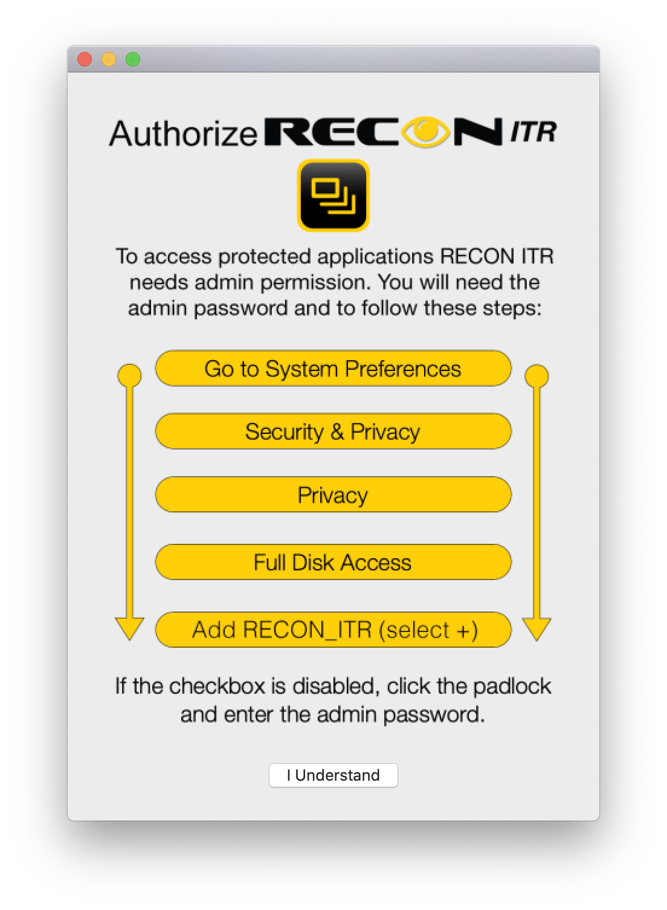

If Full Disk Access permissions are not granted, some features of RECON ITR will be unavailable or limited.

Each time RECON ITR launches a message will appear to remind the examiner about giving RECON ITR Full Disk. Access. Click **I Understand** to close the message window.

### 5.2.1. macOS 12 and Below

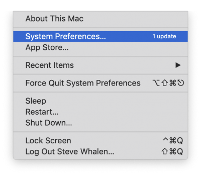

To give RECON ITR Full Disk Access on macOS 12 and below, navigate to **System Preferences** using the **Apple Menu** found in the top left corner (Apple Menu – System Preferences).

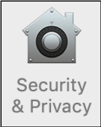

From **System Preferences** select the **Security & Privacy** icon.

Follow the steps below to add RECON ITR to the **Full Disk Access** column.

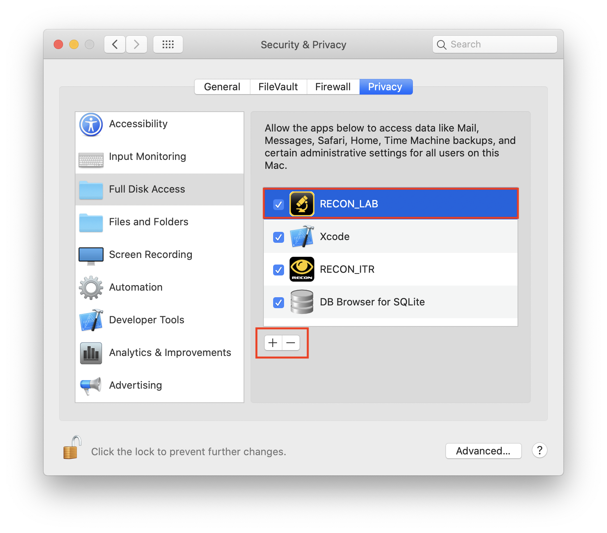

1. Click on the lock icon in the bottom left corner and enter the admin password to unlock.
2. Select the **Privacy** tab and then **Full Disk Access** in the sidebar.
3. Click the "**+**" symbol and navigate to the **RECON ITR** application.
4. Select the **RECON ITR** application to give Full Disk Access permissions.

### 5.2.2. macOS 13 and above

Alongside the release of macOS 13, Apple introduced a change to the tried and true System Preferences to make it more akin to iOS. System Preferences has now been changed to System Settings and includes a new interface.

To give RECON ITR Full Disk Access on macOS 12 and below, navigate to **System Settings** using the **Apple Menu** found in the top left corner (Apple Menu – System Settings).

From **System Settings** select the **Security & Privacy** icon on the left.

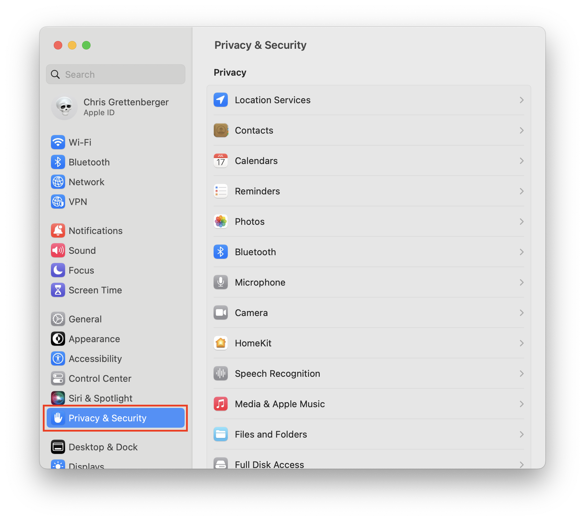

1. Navigate to **Full Disk Access**
2. Scroll to the bottom of the window to locate the "**+**" symbol.
3. Click the "**+**" symbol and enter the **administrator password**.
4. Navigate to the **RECON ITR** application.
5. Select the **RECON ITR** application and enable the switch to give Full Disk Access permissions.

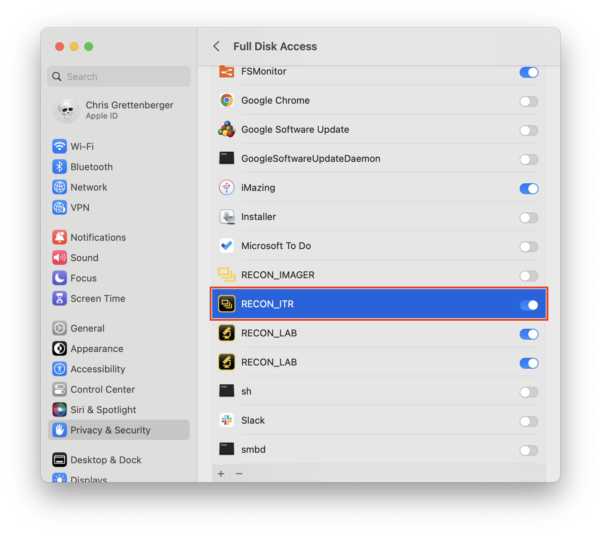

## 5.3. Energy and Sleep Settings

Allowing a Mac to go to sleep in the middle of processing a case will most likely cause issues. Make sure to disable any settings related to sleep or Power Nap when processing with RECON ITR. These settings can be changed in **System Preferences**.

Look for the **Energy Saver** icon.

If the device is a portable Mac there will be energy settings for both **Battery** and **Power Adapter**.

# 6. Imager - Before You Start

Imaging a Mac disk or volume is not as straightforward as imaging other file systems. We highly recommend that you read the following sections before you begin as it will save you from creating an unusable image.

## 6.1. How Will You Process The Image?

Before using RECON IMAGER you must ask what tool will be used to process the image that is created with RECON IMAGER?

Other than RECON LAB, there are no forensic tools that fully support all of Apple's proprietary file systems, technologies, and artifacts.

RECON LAB is the only forensic suite designed completely on a Mac to natively support Mac images and its data.

If you are going to process your image with any other tool other than RECON LAB you will miss case-solving data.

## 6.2. What To Image?

Once you have decided on the forensic tool that will be used to process the collected data the image format can now be chosen.

RECON IMAGER utilizes macOS so it will automatically detect and present traditional physical disks, logical volumes, Core Storage disks, FileVault volumes, synthesized and virtualized disks and volumes. Collection agents must be careful to select the correct volume or disk in addition to the correct image format to get usable forensic images or data.

This manual will include best practices on what to image based on what forensic tool of your choice.

It is recommended that all information in this manual is reviewed. As always, if unsure, verify before imaging.

## 6.3. What Image Format Should I Use?

Selecting the correct image format is crucial to get an image or data that will work with a specific forensic tool. RECON IMAGER has multiple imaging options to support as many forensic tools as possible.

It is important to understand that not all forensic tools can interpret proprietary Apple file systems and/or volumes. SUMURI's RECON LAB is one of the only tools that can mount all Apple file systems and interpret its data properly as it is developed on and for macOS.

In order to obtain data that can be used with other tools that do not support proprietary Apple file systems or volumes, one of RECON IMAGER's logical imaging options must be selected.

# 7. RECON IMAGER

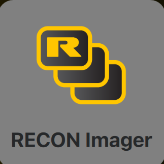

**RECON IMAGER** is a Mac-based native imaging solution. RECON IMAGER is built-into RECON ITR and supports all modern Intel-based Macintosh computers with APFS, T2 Security Chips, and Apple Silicon.

RECON IMAGER has its own manual which can be found in the various **Imager sections** of this manual.

## 7.1. Imaging a Mac with Apple Silicon

RECON ITR provides examiners the capabilities to image in any situation. Our solution adds enhanced support for the live acquisition of the machine being imaged. We improved and added new solutions to give you the ability to image all Macs (including those with Apple Silicon Processors).

*Note: Image Apple Silicon Macs using RECON ITR and process in RECON LAB to properly view native Apple Extended Attribute metadata and macOS timestamps.*

### 7.1.1. Imaging a Mac with an Apple Silicon Processor Live

RECON ITR's live imager is capable of imaging Apple Silicon Macs from the desktop.

**Click** the RECON Imager option from the RECON ITR home screen for Live Imaging.

After opening RECON Imager, you will be prompted for the machine's **Admin password**.

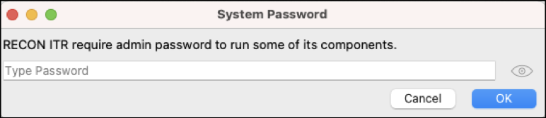

Once the admin is entered, RECON Imager will launch showing the **Disk Imager menu**.

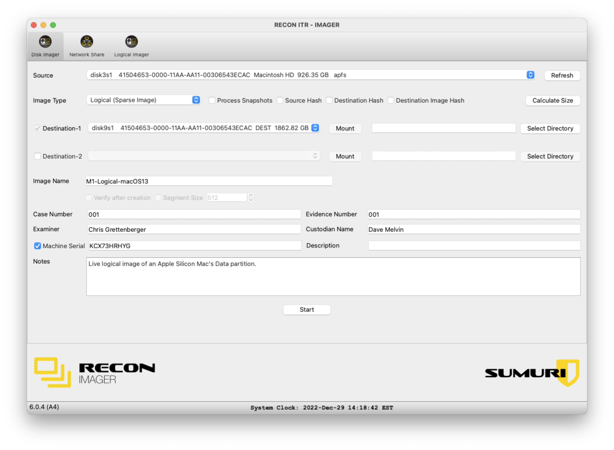

In the Source field of the RECON Imager Disk Imager menu, select the internal data partition of the synthesized disk as your source. Then, select the **Image Type**, fill out all necessary information, and click **Start**.

After imaging is completed, process the image in RECON LAB as a RECON Logical Image.

### 7.1.2. Imaging a Mac with an Apple Silicon Processor Bootable

Imaging a Mac with an Apple Silicon Processor using the bootable imager can be accomplished with RECON IMAGER Mode-M, included in versions of RECON IMAGER above Version 6.0.1.

Instructions on imaging with RECON IMAGER Mode-M can be found in the **Imager Mode-M section**.

# 8. Booting RECON IMAGER

## 8.1. On Intel Macs

As with any new forensic tool, please test and validate RECON IMAGER before using on real evidence.

Additionally, please read all the instructions and information included in this manual. If you should have any questions or concerns please contact us.

### 8.1.1. Instant On - Portable Macs

Be aware that newer MacBooks have an "instant-on" feature.

Newer Intel MacBooks will automatically boot when the lid is opened. Additionally, if the lid is already opened and power is connected, or the trackpad or keys are touched the MacBook may also start.

Make sure that you are prepared to interrupt the boot process by holding down the ALT/OPTION key in any of these situations.

### 8.1.2. Firmware Password

Mac has the ability to set a boot level password to prevent booting to any source other than the installed macOS. This is known as a Firmware Password which can be enabled or disabled by the user in the macOS Recovery Mode.

Before booting a Mac please familiarize yourself with the macOS Firmware Password option.

If a user has set the Firmware Password no startup commands other than the ALT/OPTION key will prevent booting to the login screen. If you encounter anything that looks like a "lock" when starting with the ALT/OPTION key then the Firmware Password is set.

You must enter the Firmware Password PIN  or passcode in order to see the boot options (this includes RECON IMAGER if it is attached).

Apple Certified Technicians have the ability to disable a Firmware Password.

### 8.1.3. Connecting RECON IMAGER

- Make sure that you start with the Mac powered off.
- Identify how many ports and what type of ports which are available on the Mac before you start.
- If there is only one port make sure you use a high-quality hub to add additional ports. Keep in mind that using low-quality or non-Apple certified adapters can damage the Mac.
- If using traditional spinning platters make sure that the hub used has power connected or that your drive has its own power supply.
- RECON IMAGER can be inserted into any open port on the Mac itself or via a hub using the Type-A or Type-C connector.

### 8.1.4. Connecting Your Destination Drive

See the notes listing in the previous section, **Connecting RECON IMAGER** regarding adapters, hubs, and power.

It is recommended that the formatting or initialization of the destination drive be done using RECON IMAGER, if possible.

Once the destination drive is prepared using RECON IMAGER it should be removed and tested to see if it mounts on the examination system. This step is recommended as formatting with one tool or environment may be different from another. Some operating systems may not recognize or work well with the partitioning scheme created with a different operating system.

After verifying that the destination drive can be seen by the examination system reconnect it to the Mac to be imaged.

### 8.1.5. Starting RECON IMAGER

With the Mac off, connect RECON IMAGER to an open port, press the power key, and then immediately hold down the OPTION/ALT key.

All boot options, including four from RECON IMAGER, should be displayed. Please review the supported hardware documented in this manual for assisting in choosing the correct version of RECON IMAGER.

Select the boot option that best supports the Mac being booted:

- MODE-A RECON IMAGER
- MODE-B RECON IMAGER
- MODE-C RECON IMAGER
- MODE-D RECON IMAGER

**MODE-D is for the newest Macs with an Intel processor running the latest versions of macOS, Mode-C is for newer Intel Macs running macOS 10.15 Catalina, and below, MODE-A is for the oldest Macs, and MODE-B is for everything in-between.**

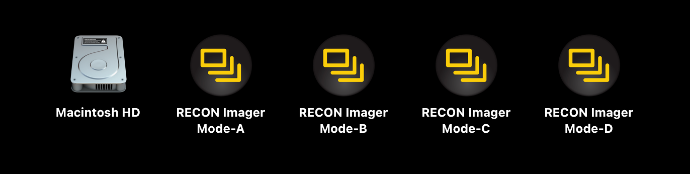

The Mac will start to boot after the selection. Be patient as this may take a couple of minutes to boot. You will see the Apple Boot Logo or the SUMURI logo while RECON IMAGER boots the Mac.

*Selecting MODE-C RECON IMAGER will prompt a language selector for English or Chinese.*

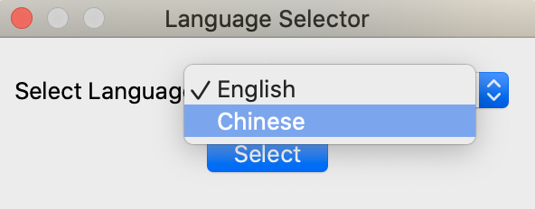

After RECON IMAGER has completed booting you will see the window below. Select the RECON IMAGER application and click the **Continue** button.

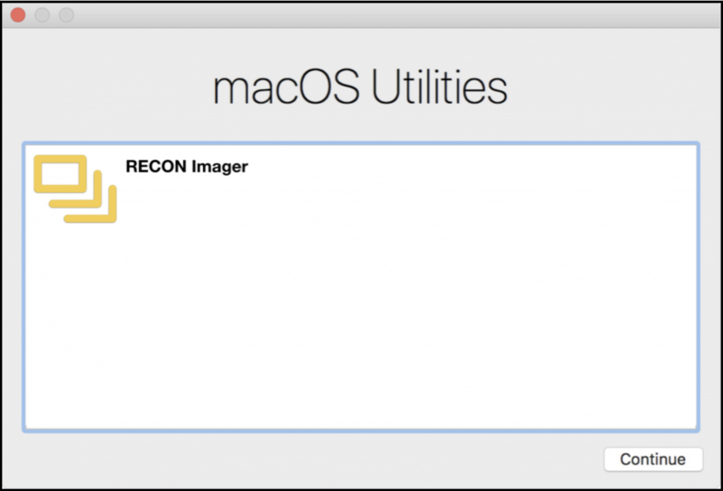

## 8.2. On Apple Silicon Macs

With the release of RECON ITR version 6.0.1 (D3) your RECON ITR SSD can now boot and image Apple Silicon Macs. RECON Imager Mode-M is designed to easily boot and image Macs with Apple silicon Processors without having to disable System Integrity Protection or Secure Boot. The process is similar to booting and imaging Intel Macs with a few deviations.

1. Identify that you are working with an Apple Silicon Mac by checking the model number at the bottom of the Mac
2. Hold the power button until the boot options are displayed
3. Choose **RECON Imager Mode-M**
4. Choose an Admin user and enter the password
5. Click **RECON_IMAGER** in the popup window
6. Choose your language and click **Select**
7. Click **Disk Imager** at the top of the IMAGER Interface
8. Image the **Macintosh HD – Data** Partition

Images made with this method can be loaded into RECON LAB as a Logical &gt; RECON Logical Image.

### 8.2.1. Known Issues

- RECON Imager's Mode-M is only capable of imaging data partitions at this time. A solution to this issue is expected within the next few updates.
- You may experience the application not running after clicking the start button in the RECON Imager launcher. This error can be solved by shutting down the computer and restarting RECON IMAGER.
- **WARNING** - RECON Imager's Mode-M uses the macOS Recovery Mode (a read only environment) to operate. This causes the application to keep the machine's current network status before booting. We recommend removing evidence devices from any previously connected networks to avoid possible issues. We recommend disabling any networking and Find My settings if possible.

# 9. Using RECON IMAGER

When RECON IMAGER loads there will be five options presented for the standard version and seven for RECON IMAGER PRO.

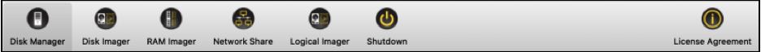

- **Disk Manager** - Displays traditional, virtual and synthesized disks and volumes.
- **Disk Imager** - The disk imaging interface.
- **RAM Imager** - The RAM imaging interface.
- **Network Share (PRO)** - The interface for configuring SMB network connections to send forensic images to a destination over the network.
- **Logical Imager (PRO)** - The interface for automated imaging of macOS artifacts or selective imaging of files and folders.
- **Shut Down** - Safely powers down the Mac.
- **License Agreement** - Displays SUMURI's License Agreement and Change Logs.

## 9.1. Disk Manager

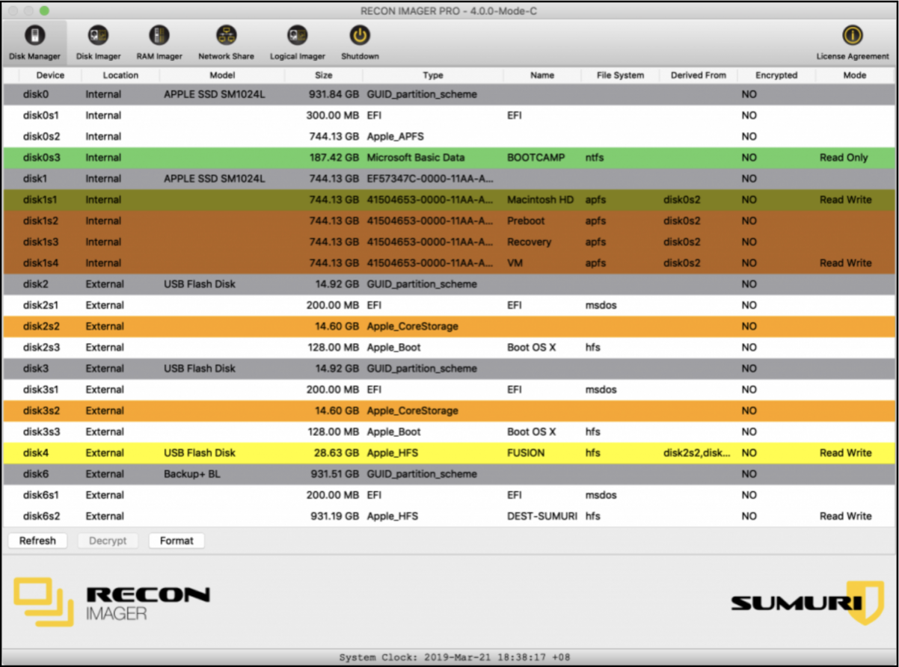

The Disk Manager allows you to see all connected devices to the Mac in a software write-blocked environment.  Each system can vary, however, the Disk Manager will show all traditional, virtual or synthesized physical disks and logical volumes.

Below are descriptions of the column names used in the Disk Manager:

- **Device** – the disk and partition (slice) identifier
- **Location** – if the drive is internal or external
- **Model** – hardware model
- **Size** – the size of the disk/partition
- **Type** – disk or volume type
- **Name** – volume name
- **File System** – the file system of the partition
- **Derived From** – list of the parent volumes for virtualized or synthesized disks
- **Encrypted** – YES, if encryption (ex. FileVault) is on – NO, if encryption is off
- **Mode** – displays the read-write status

The RECON IMAGER Disk Manager uses the following color scheme for quick identification:

| Color | What it Means |
|----|----|
| Grey | Parent disk (i.e. "disk0") |
| Green | Mounted and Read-Only (i.e. "disk0s3") |
| Red | Mounted and Read-Write |
| Orange | Apple Core Storage Logical Volume Family (i.e. "disk2s2" and "disk3s2") |
| Yellow | Mounted Fusion Disk (i.e. "disk4") |
| Light Brown | APFS Partitions |
| Olive Green | APFS FileVault Decrypted |

### 9.1.1. Refresh To Detect Changes

If a drive is attached or disconnected anytime after RECON IMAGER has been started the "Refresh" button must be clicked to search for new drives or remove drives that were previously detected.

### 9.1.2. Formatting a Collection Drive

RECON IMAGER can format a collection drive within Disk Manager. BE CAREFUL to select the correct disk to format.

From the Disk Manager tab select the disk to format and choose **Format**.

A confirmation message will appear.

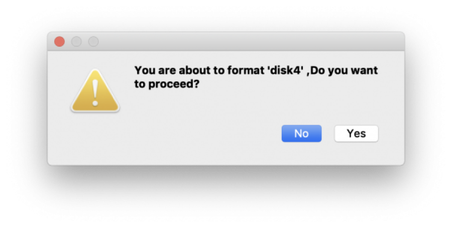

The collection drive can be formatted with an APFS, macOS Extended (HFS+) or exFAT file system.

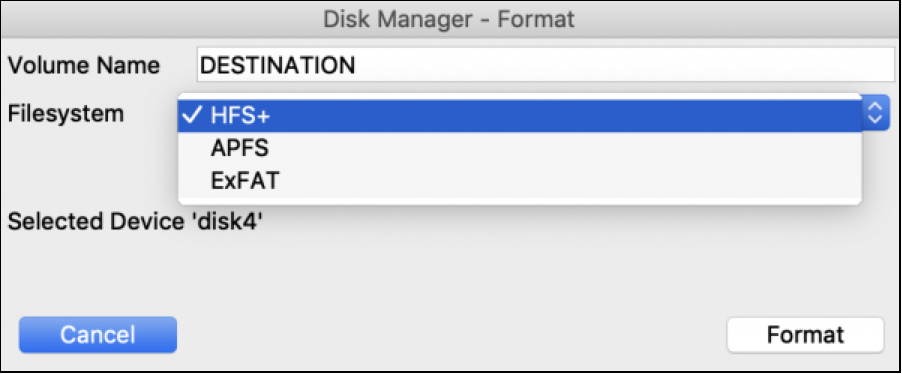

Once the collection drive has been formatted it is always good practice to attach the destination drive to the examination system to see if it will be detected properly. Although, the file system is correct the examination system may not recognize the partition scheme used in formatting. This is especially true of older operating systems.

It is highly recommended that you use HFS+ (macOS Extended) for native support in Mac environments and to preserve Apple Extended Metadata during logical imaging.

To mount Apple native file systems within Windows consider using applications such as [HFS+ for Windows by Paragon](https://www.paragon-software.com/home/hfs-windows/).

### 9.1.3. Decrypting A FileVault Volume

If an encrypted volume is found, RECON IMAGER will display a pop-up window with the disk and volume number of the encrypted disks or volumes.

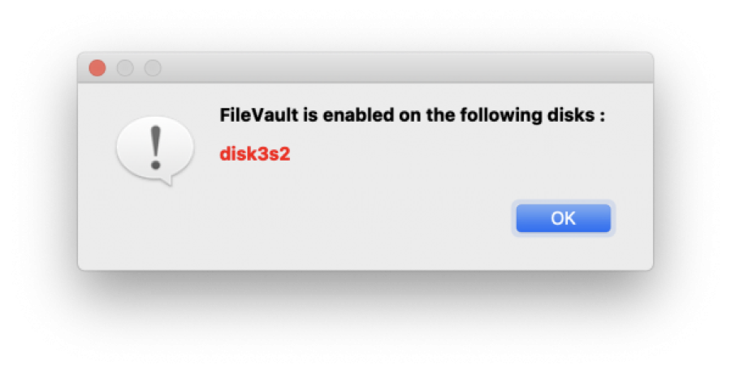

In the Device Manager you will also see **YES** in the **Encrypted** column to identify any encrypted disks or volumes.

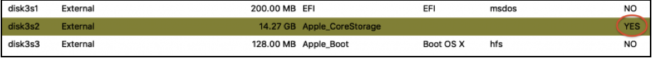

RECON IMAGER can decrypt FileVault 2 encrypted volumes if the passcode or the Recovery Key is known. To decrypt, highlight the FileVault volume within Disk Manager and select **Decrypt**.

A window will appear allowing the entry of the user's password or the Recovery Key. Once the password or key is entered select **Decrypt**.

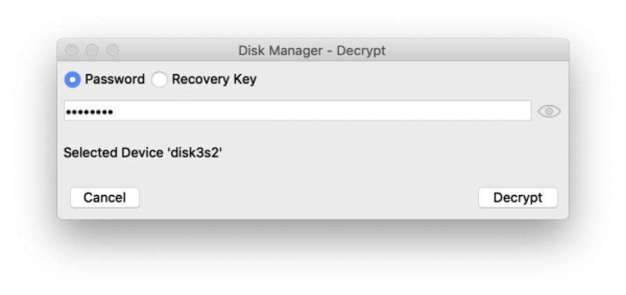

After a few moments, a status message will appear and the decrypted FileVault volume will display within the Disk Manager window.

If the FileVault volume was on a macOS Extended file system (HFS+) a new decrypted volume will mount with a new disk number.

If the FileVault volume was on an APFS file system no new volumes will mount.

### 9.1.4. System Date and Time

For convenience, the system's detected date and time will appear at the bottom of the RECON IMAGER window. This can be used to check to see if the reported system clock is accurate.

## 9.2. Disk Imager

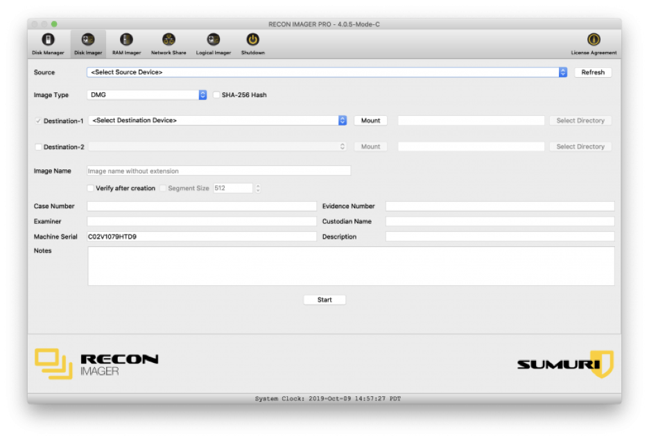

The RECON IMAGER Disk Imager allows for the acquisition of any internal disk(s) or volumes or any attached storage media including other Macs in Target Disk Mode. The options presented in the Disk Imager will change depending on what Image Type (output format) is selected.

### 9.2.1. Source

The Source field allows you to select the source device (e.g., the suspect's hard drive) to be imaged.

If the drive was recently attached, select Refresh to identify any newly connected disks.

**WARNING** – Please be familiar with imaging Apple file systems. There are many factors that will affect your selection for the source and the choice of an output format.

An incorrect choice will lead to an unusable image. Please follow the best practices suggested in this manual for different imaging scenarios.

### 9.2.2. Image Type

RECON IMAGER supports a variety of image output formats in order to allow the data to be imported into any modern forensic tool. Before selecting the Image Type be sure to check that forensic tool to be used for processing can support the output that you are generating. Many forensic tools do not natively support Apple's proprietary file systems. SUMURI's RECON LAB can process all Apple file systems without conversion and without losing important artifacts such as Apple Extended Metadata.

RECON IMAGER can produce output in the following formats:

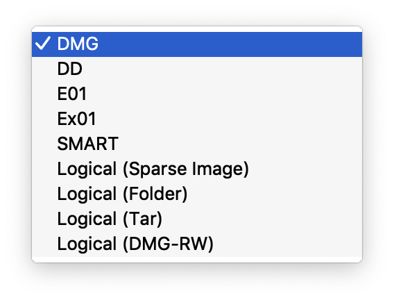

- **DMG (dmg)** - The native disk image format for macOS and what is highly recommended for image output. This image output is also a raw image that can be imported into any modern forensic tool.
- **DD (RAW)** - Bit-for-bit forensic copy of the source medium which is also a raw image.
- **EWF (E01)** - Expert Witness Format – Version 1.
- **EWF2 (Ex01)** - Expert Witness Format Version 2.
- **SMART (S01)** - ASR Data's version of EWF bitstream image.
- **Logical (Sparseimage)** - A native macOS image format that is dynamic and can only be used within the Mac environment.
- **Logical (Folder)** - A logical data extraction of the file system which is able to be used in both Mac and Windows forensic tools.
- **Logical (Tar)** - A logical archive of the file system that can be used in most forensic tools.
- **Logical (DMG-RW)** - A native macOS image format that is static and can only be used within the Mac environment.
- **ASR (Sparseimage)** - ASR imaging uses Apple's native system restore feature to logically acquire a sparseimage of a machines Synthesized Disk

### 9.2.3. Compression Options

Compression options are available for the Expert Witness formats (.E01, .Ex01) and ASR Data's SMART image format (.S01).

- **none** - No compression (fastest)
- **fast** - Compression is minimal while imaging speed is maximized (fast).
- **best** - Compression is the most efficient, however, the imaging process will be prolonged (slowest).

### 9.2.4. Processing Local Time Machine Snapshots (APFS)

RECON IMAGER is an intelligent imager and the only solution to identify Local Time Machine Snapshots (APFS Snapshots) prior to imaging.

If Local Time Machine Snapshots exist a window will appear allowing the user to select all or individual snapshots for imaging.

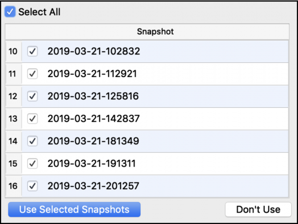

Once selected, RECON IMAGER will process the Local Time Machine Snapshots at the time of imaging to dramatically reduce the size of the collection as compared to physical imaging.

RECON IMAGER's Advanced Snapshot Processing finds all files modified or previously deleted by the user within the snapshots selected.

### 9.2.5. Destination

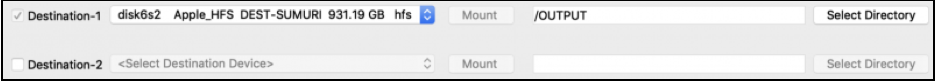

RECON IMAGER has the ability to image to two destinations at the same time. If a second destination is required just select the checkbox to activate the dropdown.

RECON IMAGER also allows you to choose and/or create directories to send the images to by clicking **Select Directory**.

### 9.2.6. Image Name

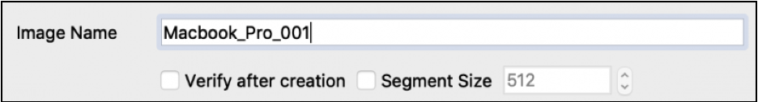

Use the **Image Name** field to provide a unique name for your image output. The label provided will be the name for the parent folder containing the image output and any logs.

Other than the Logical Image (Folder) option the name provided in the **Image Name** field will also be used for the image output files.

### 9.2.7. Segment Size

RECON IMAGER allows for certain image outputs to be segmented if required. If the image output selected supports segmenting within RECON IMAGER the **Segment Size** checkbox will be active.

To set the segment size check the box next to **Segment Size** and enter the size in MBs.

Segmenting is not available for the .dmg image output or any of the logical imaging formats.

### 9.2.8. Evidence Descriptor Fields

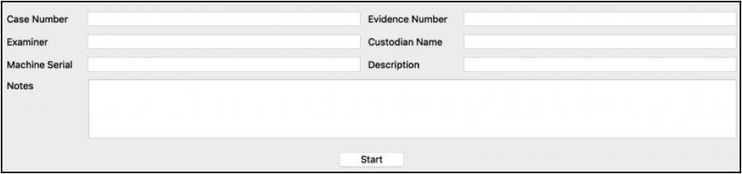

Before imaging, optional identifying information about your source may be entered.

- **Case Number** – Relevant case number.
- **Evidence Number** – Unique evidence/log number.
- **Examiner** – Individual creating the image.
- **Custodian Name** – Custodian of the evidence.
- **Machine Serial** – Serial Number of the booted device which is automatically populated when possible.
  - **MODE-C RECON IMAGER** - Unchecking the machine serial box will allow the examiner to manually input a serial number.

- **Description** – Description of the media being imaged.
- **Notes** – Any additional information relevant to the investigation.

### 9.2.9. Hashing and Verification

#### 9.2.9.1. Traditional Image Types

An MD5 and SHA-1 hash of the SOURCE will be calculated for the following image types:

- dd (RAW)
- EWF (E01)
- EWF2 (Ex01)
- SMART (S01)
- DMG (dmg)

For DD and DMG images there is also the option to select SHA-256.

For the traditional image types listed above, there is an option of selecting **Verify after creation** within Disk Imager.

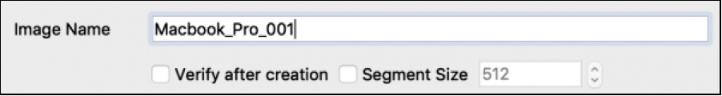

If **Verify after creation** is selected an MD5 and SHA-1 will be calculated for the OUTPUT.

A summary of the hashing will be displayed in a pop-up window at the completion of the imaging and can also be found in the logs within the image output folder.

#### 9.2.9.2. Logical Image (Folder)

For the Logical Image – Folder option a hash can be calculated for both the **Source** files and the files copied to the **Destination**.

#### 9.2.9.3. Logical Image (Tar)

For the Logical Image – Tar option a hash can be calculated for both the **Source** files and of the .tar image created on the **Destination**.

#### 9.2.9.4. Logical Image (Sparseimage and DMG-RW)

For the Logical Image – Sparseimage and DMG-RW option a hash can be calculated for both the **Source** files and the files copied to the **Destination**.

Note: Be advised that the hashing of every individual file during a **Logical** image WILL TAKE TIME.

# 10. APFS Imaging

Many forensic tools do not natively support APFS. By creating **traditional** image your forensic tool may not see the data.

Traditional forensic tools that can mount APFS volumes may still have limitations such as:

- No access to Apple Extended Metadata
- Limited access to Apple Extended Metadata
- Limited parsing of Apple Extended Metadata
- Inability to utilize proper timestamps

RECON LAB from SUMURI is the first and only tool that can identify and properly parse Apple Extended Metadata and its timestamps.

Apple Extended Metadata is extremely important in macOS investigations. Ignoring Apple Extended Metadata is equivalent to a doctor performing surgery after only seeing a small portion of an entire battery of test results and scans.

There are two ways to image APFS. The first is for processing with RECON LAB in order to see all the Apple Extended Attributes and timestamps. The second is for importing into traditional forensic tools.

## 10.1. APFS Imaging to Process with RECON LAB

### 10.1.1. APFS Imaging to Process in RECON LAB

#### 10.1.1.1. Non-T2 Chipset Macs

When Imaging a non-T2 mac, select the physical disk containing the APFS Container and volumes. On a single internal drive, this is usually **disk0**. Be careful not to select the APFS synthesized container disk.

Your image type should be set to .dmg.

A benefit of processing the image with RECON LAB is that you do not have to decrypt before imaging.

#### 10.1.1.2. T2 Chipset Macs

When Imaging a T2 mac, select the user volume within the APFS synthesized disk. On a single internal drive, this is usually **disk1s1**.

Your image type should be set to Logical (.sparseimage or DMG-RW)

Note: RECON IMAGER is the only solution to preserve original source timestamps when selecting logical imaging and processing in RECON LAB.

### 10.1.2. APFS Imaging Using ASR in RECON ITR Live

On a live machine the APFS Container Disk can be imaged using ASR Imaging. After you launch RECON IMAGER included in the Live Version of RECON ITR select disk1. The only image type available will be ASR, this will output a logical .sparseimage of the entire APFS drive. This .sparseimage can be loaded into RECON LAB as a RECON Logical image in order to preserve the original source timestamps.

### 10.1.3. ASR Imaging with FileVault using RECON ITR Bootable

When imaging a APFS container with FileVault enabled, be sure to Decrypt the the partition before adding it as a source in the Disk Manager. If not, you will be prompted with a message in Disk Imager to decrypt the volume before imaging.

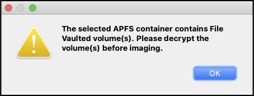

Once the partition is decrypted using the password, select the FileVault encrypted volume as a source in Disk Imager and click Refresh.

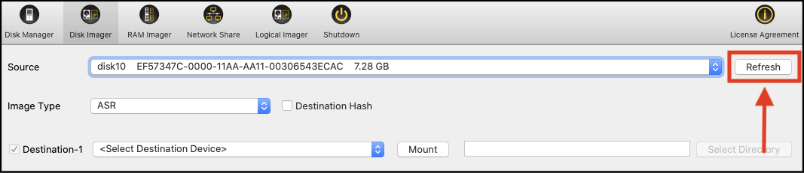

Then, you can input the necessary information and click Start to begin the imaging process.

## 10.2. APFS Imaging to Process in Other Tools

Note: If you are not using RECON LAB test and validate that your forensic tool supports APFS encrypted and/or decrypted images. All other solutions, other than RECON LAB, support APFS in various degrees as their APFS support has to be reversed engineered. RECON LAB is the only solution that supports APFS natively.

If your tools do not support physical images of non-T2 Chipset Macs then follow the best practices below.

### 10.2.1. APFS – NO FILEVAULT – PROCESS IN OTHER TOOLS

Source: Select the volume containing the user data within the APFS synthesized container disk.

Typically, there are four or five volumes (the user DATA volume, Preboot, Recovery, VM). There is an extra "system" volume for macOS 10.15 and above which has the label "DATA" appended to the volume name. Select the DATA volume and be aware the name can vary. The default volume name is usually "Macintosh HD".

Image Type – You have two options.

- Option-1: Logical Image (Folder) – this is a logical copy of the files from the source to the destination.
- Option-2: Logical Image (Tar) – this is a logical copy of the files from the source placed into a .tar archive. This option will take longer then Option-1. Make sure your forensic tool supports unpacking a .tar archive file properly to preserve the directory structure.

Note: RECON IMAGER used along with RECON LAB is the only solution to maintain the source timestamps during logical imaging.

### 10.2.2. APFS – WITH FILEVAULT – PROCESS IN OTHER TOOLS

Use the Disk Manager to select the APFS container volume with the user data as described above and select the "Decrypt" button. Use the password or Recovery Key option to decrypt the FileVault volume. If you are collecting information from macOS 10.15 or above also decrypt the System volume.

Once decrypted follow the steps listed above for imaging.

# 11. Storage Imaging - Single Disk

## 11.1. CORE STORAGE – SINGLE DISK – NO FILEVAULT

**Source** – Select the physical disk which is usually **disk0**. This can be identified in the Disk Manager.

**Image Type** – DMG (remember, this is also a raw image and can be imported into other tools).

## 11.2. CORE STORAGE – SINGLE DISK – WITH FILEVAULT

Use the Disk Manager to select the physical disk as described above and select the **Decrypt** button. Use the password or Recovery Key option to decrypt the FileVault volume.

Once decrypted a new disk will mount. In Disk Imager select the newly mounted decrypted disk to image.

**Source** – Select the newly decrypted mounted disk.

**Image Type** – DMG (remember, this is also a raw image and can be imported into other tools).

# 12. Fusion Drive Imaging

## 12.1. FUSION DRIVE – NO FILEVAULT

**Source** – Select the virtualized physical disk which is usually derived from **disk0s2** and **disk1s2**. This can be identified in the Disk Manager.

**Image Type** – DMG (remember, this is also a raw image and can be imported into other tools).

## 12.2. FUSION DRIVE – WITH FILEVAULT

Use the Disk Manager to select the virtualized physical disk with the user data as described above and select the **Decrypt** button. Use the password or Recovery Key option to decrypt the FileVault volume.

Once decrypted a new disk will mount. In Disk Imager select the newly mounted decrypted disk to image.

**Source** – Select the newly decrypted mounted disk.

**Image Type** – DMG (remember, this is also a raw image and can be imported into other tools).

## 12.3. FUSION DRIVE – APFS macOS 10.14

Use the Disk Manager to identify the user data partition of the synthesized APFS Fusion drive. The logical volume will be displayed underneath the APFS Synthesized Volume (usually named "Macintosh HD"). The examiner will have to decrypt the volume if FileVault is enabled. Once decrypted, a logical image can be made.

**Source** – Select the decrypted user DATA partition (usually named **Macintosh HD**).

**Image Type** – Any Logical Option. The sparse image or DMG-RW format is best with Mac-based Forensic tools such as RECON Lab while the Folder or .tar format is best for usage in Windows-based Forensic tools.

## 12.4. FUSION DRIVE – APFS macOS 10.15 and Above

Use the Disk Manager to identify both the user DATA partition and the System partition of the synthesized APFS Fusion drive. The user DATA partition will be displayed under the APFS Synthesized Volume (usually named **Macintosh HD - DATA**). The System partition will be displayed underneath the APFS Synthesized Volume (usually named "Macintosh HD"). The examiner will have to decrypt both volumes if FileVault is enabled. Once decrypted, a logical image can be made by selecting the user DATA partition.

**Source** – Select the decrypted user DATA partition (usually named **Macintosh HD - DATA**).

**Image Type** – Any Logical Option. The sparse image or DMG-RW format is best with Mac-based Forensic tools such as RECON Lab while the Folder or .tar format is best for usage in Windows-based Forensic tools.

# 13. Imaging a Mac with a T2 Chipset

Newer Macs have been shipping with proprietary T2 Security Chipsets which add extra layers of security. One of these new security features prevents booting from external media. This **Secure Boot** is enabled by default and can only be turned off in Recovery Mode and with an admin password.

We strongly recommend that you take your own Mac with you to incident response scenes.

In the event that the examiner has attempted to boot a T2 Chipset Mac with RECON IMAGER without disabling Secure Boot and booting from external media you may see the following message: "*A Software Update is required to use this startup disk.*"

There are currently two methods for imaging a Mac with a T2 Chipset disabling Secure Boot and Startup Utilities or through Target Disk Mode.

## 13.1. Disable Secure Boot and Booting to External Media form Recovery Mode

1. Ensure your RECON IMAGER USB is updated to the latest version.
2. Boot the source Mac into Recovery Mode by pressing and holding the Command + R keys on startup.
3. From the top menu, select **Utilities** then click on **Startup Security Utility**.
4. You'll be prompted to enter an administrator password.
5. In the Startup Security Utility set "Secure Boot" to No Security and **External Boot** to Allow booting from external media.
6. Shutdown the Mac after changing the settings.
7. Insert the RECON IMAGER USB to the source Mac.
8. Power up the source Mac while holding down the ALT/Option key.
9. Use MODE-C.
10. Follow the instructions in this manual to create a logical image of a T2 Security Chipset Mac.

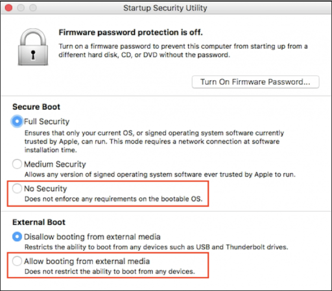

## 13.2. Target Disk Mode (TDM)

1. Place the Mac with the T2 chipset into Target Disk Mode (TDM) by holding down the **T** key when starting the computer. You will see symbols displayed on the screen. These symbols represent supported methods for connecting the Mac to another computer (i.e., Thunderbolt, USB 3.1).
2. Boot a second Mac with RECON IMAGER and a collection drive.
3. Start RECON IMAGER on the second Mac which is capable of supporting APFS.
4. Using a proper cable, connect the Mac in TDM to the second Mac booted with RECON IMAGER.
5. Use the **Refresh** button to view the disks and volumes of the Mac in TDM. If the Mac in TDM is using 10.14.5 or above you will need to know an admin password to complete the connection.
6. Follow the instructions in this manual to create a logical image of a Mac with a T2 Security Chipset.

# 14. Imaging Mac RAM

RECON IMAGER allows you to image Mac RAM without the need for an admin password (required in a live environment) within the RECON IMAGER boot environment.

To image Mac RAM on a live running system please use **RECON ITR** for Live Imaging.

**Note: Imaging Mac RAM is not a 100% guarantee. Mac RAM is protected and it is not intended to be imaged. Many factors such as hardware, kernel version, and other processes running in RAM can affect a successful image.**

To increase your chances of obtaining a successful RAM image, the following suggestions are recommended.

- If a Mac is up and running do not shut it down. Connect RECON IMAGER and attempt a soft restart and immediately boot to RECON IMAGER.
- If a Mac desktop is powered off but still plugged in do not unplug. Connect RECON IMAGER and follow the steps below to image RAM.

## 14.1. Mac is on and you have access to the Desktop

1. Plug in the RECON IMAGER USB and your destination drive.
2. Use the Apple Menu (upper left) to select "Restart".
3. Hold down the Alt/Option key during the restart to display boot options.
4. Select the RECON IMAGER Mode that supports the Mac that you are booting.
5. Use the RAM Imager to immediately image the RAM.

The RAM image that is created can be processed using RECON LAB or another tool of your choice.

## 14.2. Mac is on and you do not have access to the Desktop

Some older Macs can be restarted by force. This does not work with Macs that have a Touch Bar.

- Command + Control + Power Button – Forces restart your Mac.
- Command Control + Media Eject button – Quits all apps and restarts the Mac.

## 14.3. RAM Imager Interface

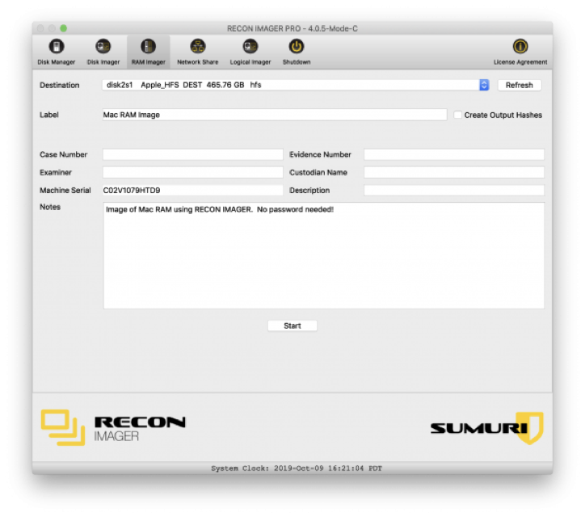

1. To image RAM after booting to RECON IMAGER select the **RAM IMAGER** tab.
2. Click **Refresh** to poll any attached devices.
3. Choose your **Destination** drive.
4. Provide your image with a name in the **Label** field.
5. **Optional** – Fill out the case information.
6. Click **Start**.

Keep in mind that Mac RAM is protected by design which can sometimes lead to unsuccessful imaging.

# 15. RECON IMAGER Logical Imaging

Selective Logical Imaging is available in the latest versions of RECON IMAGER. This feature offers the ability to select and image specific user accounts, folders and/or files. This is useful if the scope of your data collection has been limited or to save time by grabbing only the data that you need.

## 15.1. RECON IMAGER - Logical Imager

To use the Logical Imager select the volume where the files of interest are stored in the **Source** dropdown. Fill in any of the optional case information and click **Select** to open the full Logical Imager interface.

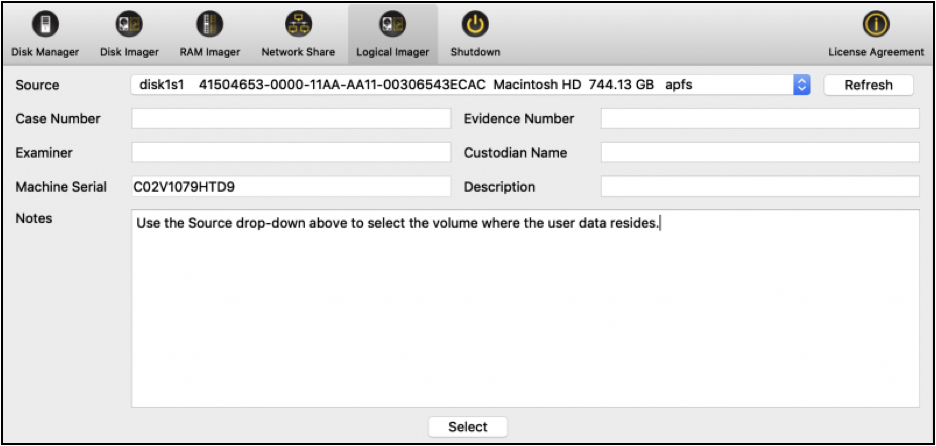

### 15.1.1. Logical Imager File System

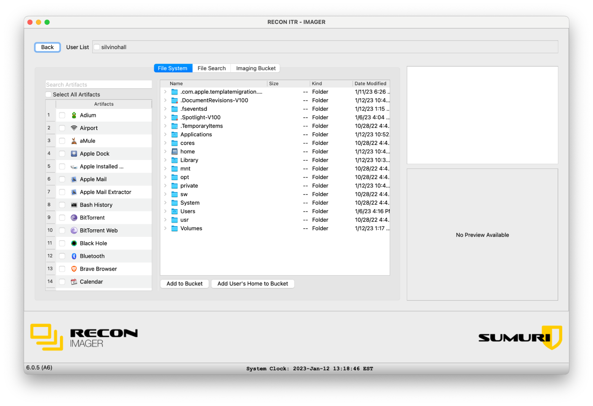

Below are descriptions of the important areas of the File System Tab:

- **User List** – Allows for the selection of individual users or all users on the volume selected. Selected artifacts will be captured for the users selected.
- **Artifact Selection** – Selecting any or all of these artifacts will automatically recover the files containing information related to the selected artifact during the logical imaging.
- **File System Tree** – Displays a collapsible list of the file directory structure of the selected disk.
- **Add to Bucket** – Add a selected folder or file from the File System tree to the **Imaging Bucket**.
- **Add User's Home to Bucket** — Add any user's home directory selected in the **User List** to the **Imaging Bucket**.

### 15.1.2. Logical Imager File Search

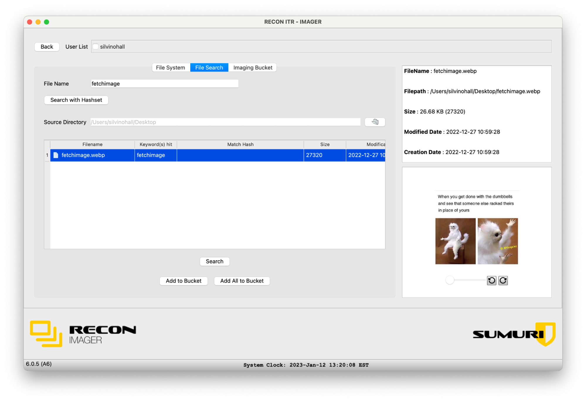

Below are descriptions of the important areas of the File Search Tab:

- **File Search Tab** – Allows you to search for file/folder names or extensions, then you can highlight results in the window and add them to the **Imaging Bucket**.
- **Search with Hashset** – In addition to searching a machine by keyword, you can load a CSV or SQLite hashset. The loaded hashset is then used to find matching images that can then be extracted via a targeted logical image.
- **Add to Bucket** – Add a selected folder or file from the **Search Results** tree to the **Imaging Bucket**.
- **Add All to Bucket** — Add all results from a search to the **Imaging Bucket**.

### 15.1.3. Logical Imager Imaging Bucket

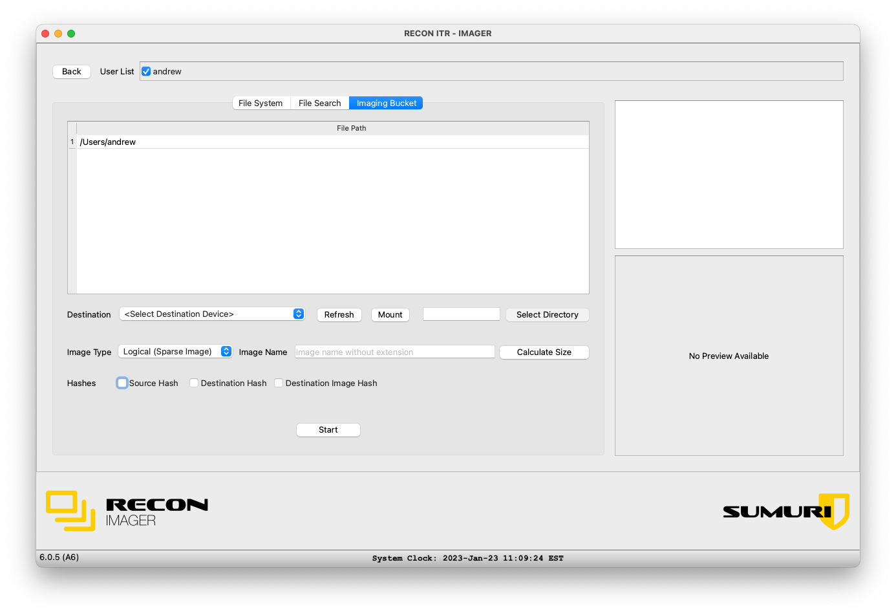

Below are descriptions of the important areas of the Imaging Bucket Tab:

- **Imaging Bucket** – Lists the files and folders that have been selected to be included in the logical image.
- **Destination** – Use this dropdown box to select your destination drive. If you are using the "Logical" image type you should use a destination drive formatted as macOS Extended or APFS to preserve the Apple Extended Metadata which is important for your investigation.
- **Logical Image Type** – This is the format you would like to use to create your logical image.
  - **Sparse Image** will put your selected files into a .sparseimage file. This file can be natively mounted on a Mac and can be processed by RECON LAB depending on what was selected for imaging.
  - **DMG-RW** will put your selected files into a .dmg file. This file can be natively mounted on a Mac and can be processed by RECON LAB depending on what was selected for imaging.
  - **Folder** copies selected plugins artifacts, directories, and files to the destination logically. If you want to preserve Apple Extended Attributes make sure the destination drive is formatted APFS or macOS Extended. Choosing the "Logical (Folder)" image type will allow you to import the data collected into most forensic tools.
  - **TAR** is a compressed logical data image that maintains native timestamps; able to be used in Mac or Windows forensic tools.
- **Image Name** – Name for your forensic image.
- **Calculate Size** – Used to provide an estimate of the size of the logical data to be imaged.
- **Source Hash** – This option will conduct a "pre-hash" of the files selected before the imaging.
- **Destination Hash** – This option will hash the image output.
- **Mount** – used for mounting a destination volume to select or create a directory
- **Start** – begins the imaging process.

Note: The number and size of the files will affect the time it takes to hash and create the image.

## 15.2. RECON IMAGER - Network Share

Latest versions of RECON IMAGER allow for imaging to a destination on a network configured via SMB.

## 15.3. Network Share Interface

RECON IMAGER allows you to enable networking and configure a SAMBA share allowing you to image to a network destination such as a NAS or Evidence Server.

Select the Network Share Tab in RECON IMAGER PRO to begin.

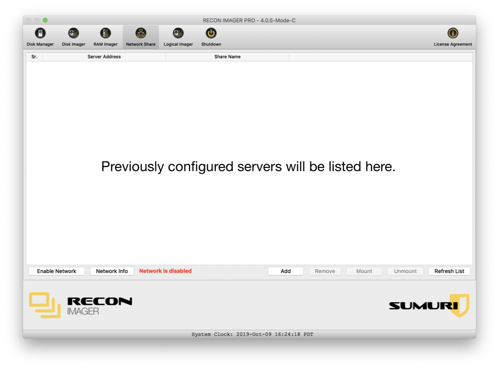

RECON IMAGER PRO has the ability to save and store previously configured networked settings. These will be shown in the main window above.

To configure a network destination start by selecting the "Enable Network" button to turn on networking.

Next, click the Add button to activate the Network Share Configuration window.

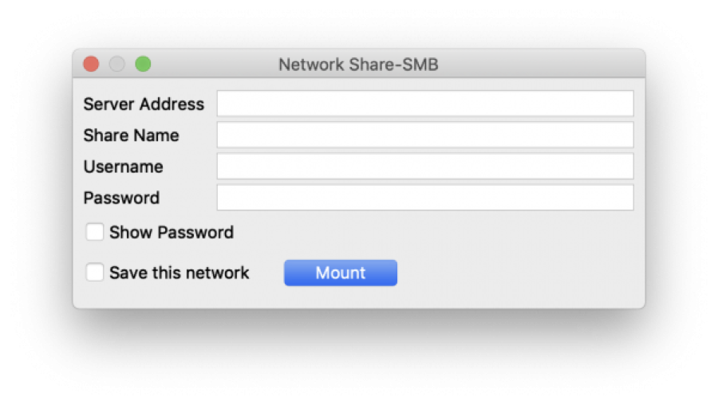

RECON IMAGER PRO supports SAMBA. Enter your SAMBA network settings and credentials. If you would like to save the network configuration check "Save this network".

After the network settings have been entered click "Mount".

Once added, your network destination will be added and visible as a Destination option for imaging.

### 15.3.1. Network Info

Selecting the "Network Info" button within the Network Share tab brings up a Network Information window with three additional features.

#### 15.3.1.1. Network Interface

The **Network Interface** tab provides information about active networks.

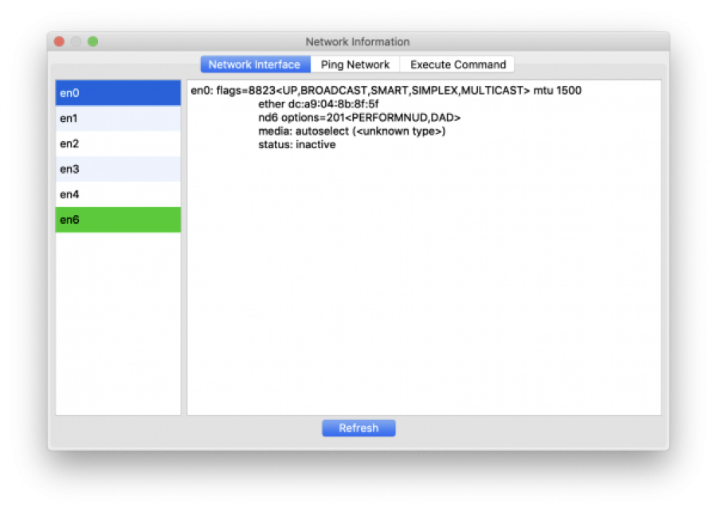

#### 15.3.1.2. Ping Network

The **Ping Network** tab allows you to test if a network is active by entering a network address and selecting the **Ping** button.

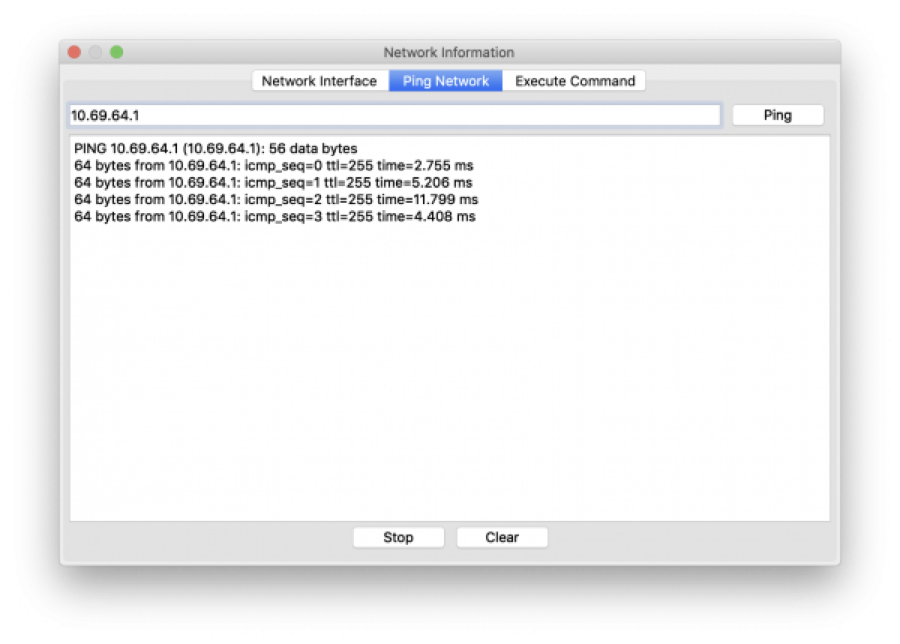

#### 15.3.1.3. Execute Command

The **Execute Command** button allows you to enter single Terminal command and shows the results of those commands.

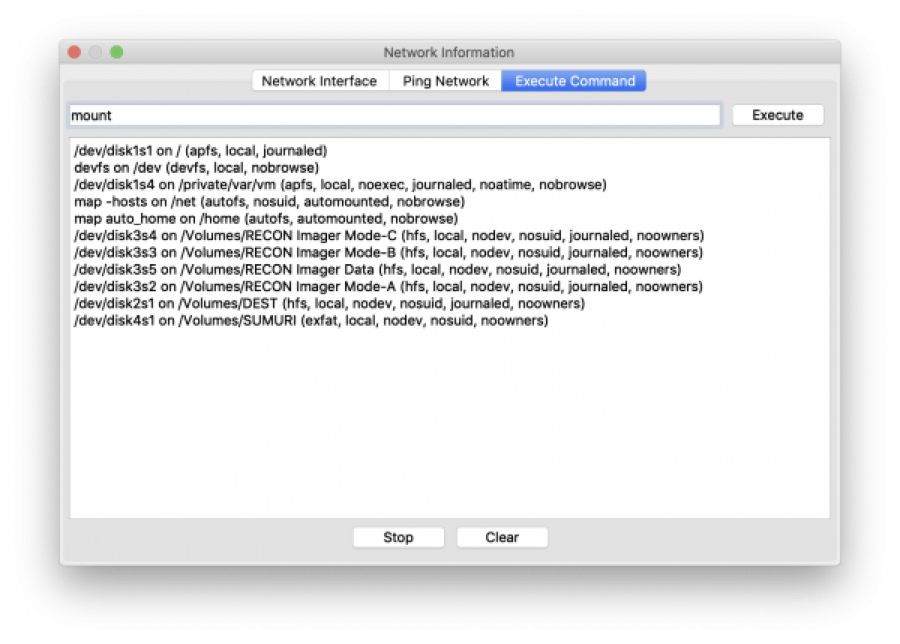

# 16. Starting RECON ITR

To start RECON ITR, double-click on the RECON_ITR icon from its location.

To run RECON ITR from an examination Mac and for quick access, drag the RECON ITR icon to the dock to create a shortcut.

## 16.1. Adding the RECON ITR License

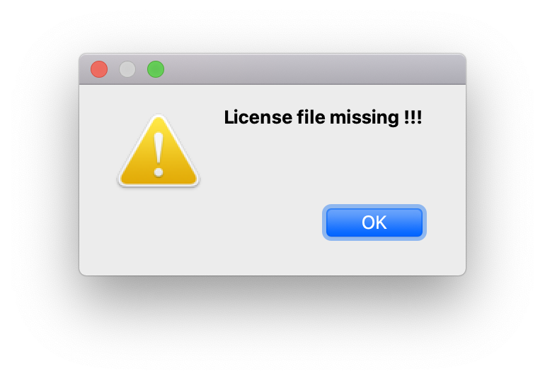

Demos and newly downloaded updates of RECON ITR will not have the license file loaded and a message will appear.

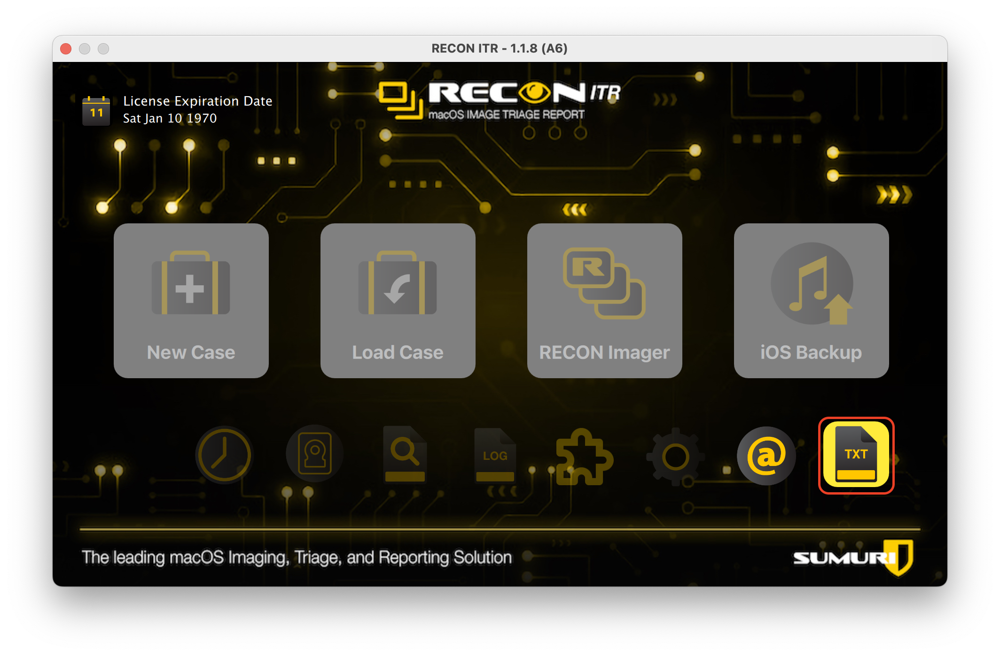

After clicking **OK**, the RECON ITR Welcome Screen will appear. Click the **New License** button and navigate to the license file.

The license can be found on the RECON ITR external drive in a folder. The RECON ITR external drive is also the security dongle and will need to be connected while in use.

If a demo was requested or if RECON ITR was recently renewed the license will be sent by email. Please backup and do not lose your license.

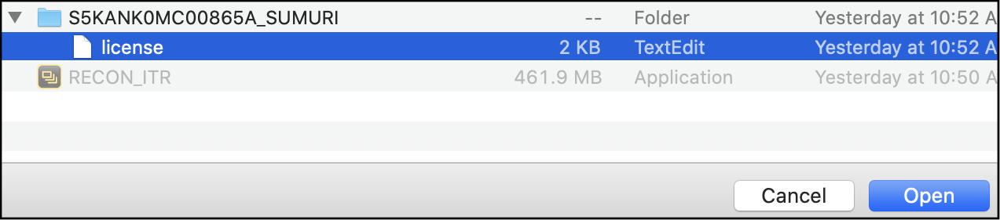

Select your license file and choose **Open**.

Quit RECON ITR and start RECON ITR again. If the license was successful in loading all of RECON ITR's buttons will be active.

# 17. RECON ITR Welcome Screen

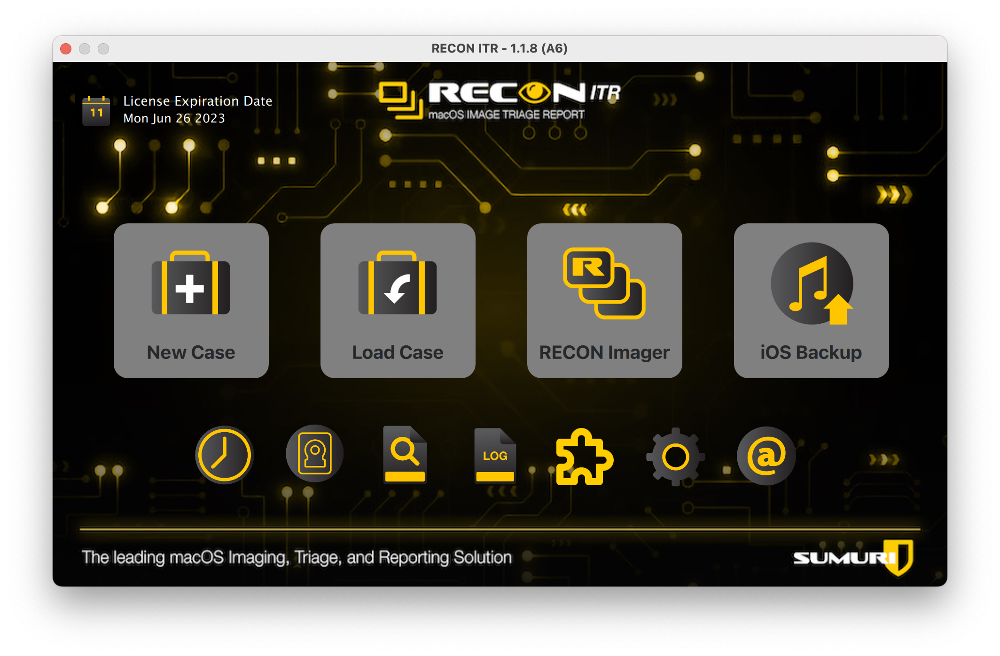

Upon starting RECON ITR the examiner will be presented with the **Welcome Screen**.

The Version of RECON ITR will be found in the title bar.

RECON ITR Modules are found along the sidebar of the Welcome Screen. Each of these modules will be explained in more detail later. If RECON ITR detects that a Module is not supported by the macOS currently running, it will automatically be removed from the Welcome Screen sidebar.

Below is a summary of each module:

| RECON ITR Modules | Summary of Module |
|---|---|
| New Case | Starts a New Case to allow the automated analysis of a live running Mac or a Mac connected in Target Disk Mode. |
| Load Case | Load a case which has already been processed by pointing to its Case Folder. |
| iOS Backup | Automatically detect, extract or perform automated analysis of iOS Backups. |
| File Search | Find files on any volume using File Signature, Content or File Name searches. |
| File Timeline | Build detailed file system timelines. |
| Snapshots | Detect and image Local Time Machine Snapshots (APFS) using differential analysis. |
| Disk Manager | View attached disks and volumes. Use built-in Write-Blocking and Read-Only mounting to triage attached devices including other Macs in Target Disk Mode. |
| RECON Imager | Advanced imager for all Macs and other devices. |
| Log Collect | Collect Mac Unified Logs in text-based or Log Archive formats. |
| RAM Imager | Allows for the imaging of Mac RAM in raw format if the password is known. |
| Plugins | List of General and Special plugins. |
| Configuration | Used to set the examiner and agency details and logo. Also, used to copy settings, examiner details and templates from other versions of RECON ITR applications. |
| About RECON | Access to RECON ITR's EULA, change logs, exceptions and/or known issues, support and update information. |

# 18. Configuration

There are two tabs available in the Configuration Module.

## 18.1. Report Header Details

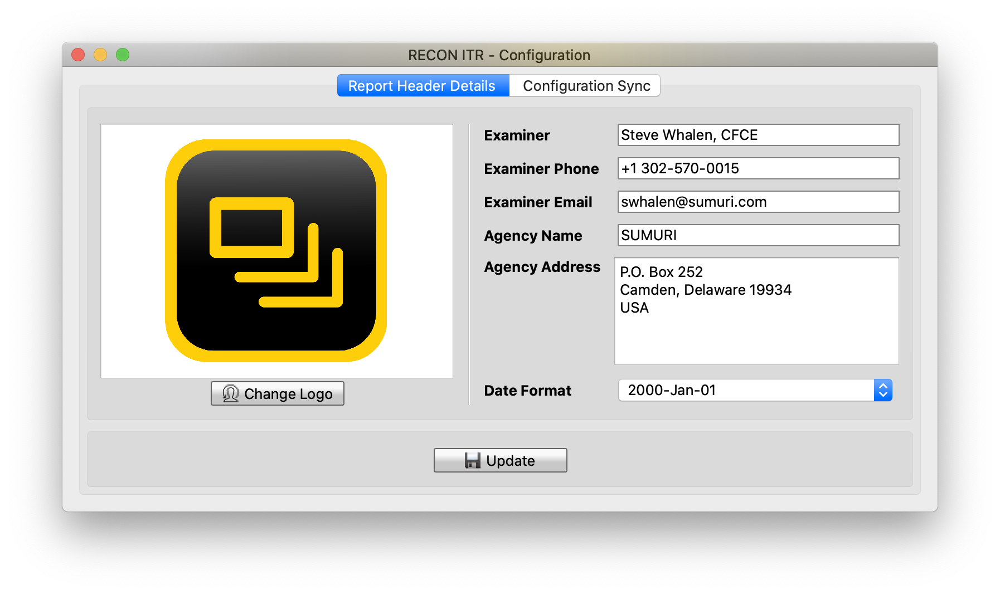

The first tab of the Configuration module allows an examiner to enter the following information which will be included in generated reports.

- Examiner
- Examiner Phone
- Examiner Email
- Agency Name
- Agency Address

## 18.2. Setting the Agency Logo

The agency logo can be changed by clicking the **Change Logo** button in the Report Header Details tab of the Configuration module and navigating to the image to be used. Both JPEG and PNG image formats can be accepted.

## 18.3. Setting the Date Format

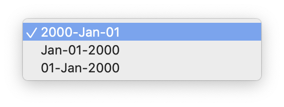

The Date Format can be changed by using the **Date Format** dropdown list in the Report Header Details tab of the Configuration module.

## 18.4. Configuration Sync

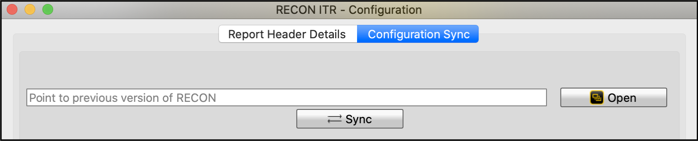

The configuration settings can be transferred from one version of RECON ITR to another. Settings include examiner and agency information, the agency logo, search configurations and templates. The Configuration Sync is useful when updating RECON ITR or when standardizing multiple versions of RECON ITR.

To synchronize the configuration settings select the **Configuration Sync** tab in the Configuration module. Use the **Open** button to navigate to a RECON ITR application that has the settings that will be synced to the new application. Once the RECON ITR application has been selected click the **Sync** button.

# 19. Starting a New Case

To triage a Mac using RECON ITR click the **New Case** button found in the **Welcome Screen**.

The New Case window will appear.

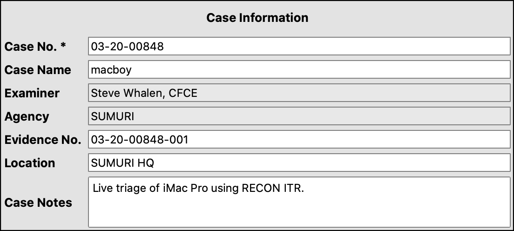

Start by entering the **Case Information**. Note that the Examiner and Agency info must be set in the Configuration Module or these fields will remain blank.

- Case No. (required field)
- Case Name
- Examiner (must be set previously in the Configuration Module)
- Agency (must be set previously in the Configuration Module)
- Evidence No.
- Location
- Case Notes (free form field)

## 19.1. Selecting the Source

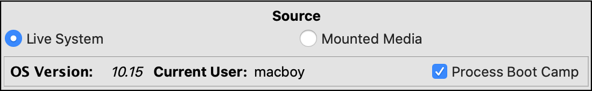

There are several options available when processing a source device. The default is the Live System.

### 19.1.1. Live System Triage

The **Live System** is the device that is currently running RECON ITR. RECON ITR will attempt to identify the version of macOS that is installed and automatically adjust some of the features and plugins. For example, the Keychain plugin will be removed for macOS 10.13 and higher as it is not supported.

The current version of macOS will be displayed next to **OS Version** (macOS version). Additionally, the **Current User** short name will be displayed.

When processing a Mac Live System it is important to note that RECON ITR will be limited to the permissions of the current running user. For example, RECON ITR cannot process other user's data on the system as each user on a Mac is segregated from each other. To process all users with RECON ITR the Mac must be placed in Target Disk Mode or imaged using RECON IMAGER and processed with RECON LAB.

To process the current running system and its user artifacts select **Live System**.

### 19.1.2. Process Boot Camp

If RECON ITR detects that Windows is installed in a Boot Camp partition the examiner will have the option to process the Boot Camp artifacts as well.

To include the processing of Windows installed via Boot Camp check **Process Boot Camp** in the **Source** options.

### 19.1.3. Process Mounted Devices

RECON ITR can process **Intel Macs** connected via Target Disk Mode. Apple Silicon Macs can not be placed in Target Disk Mode, as it was replaced with a **Sharing Mode**. Instructions for connecting a Mac in Target Disk Mode can be found in the **Tutorials section** at the end of this manual.

Make sure that instructions have been followed to properly connect and mount the Mac volumes to process.

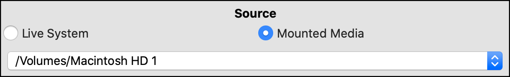

Select the **Mounted Media** button to activate the dropdown box and select the volume to be processed.

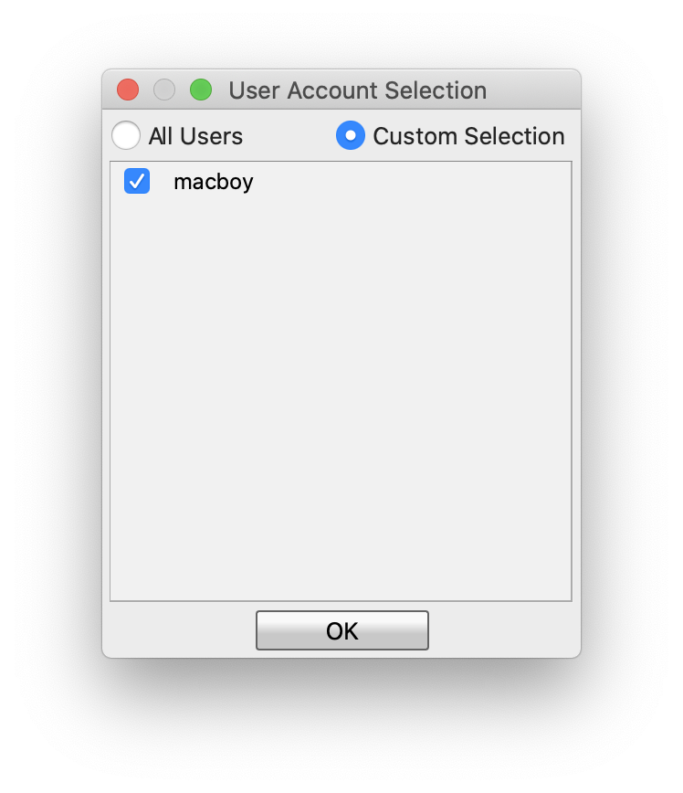

After selecting the volume with user data the **User Account Selection** window will appear.

Selecting **All Users** will process all of the user artifacts on the volume. Selecting **Custom Selection** will allow the examiner to select user accounts to process.

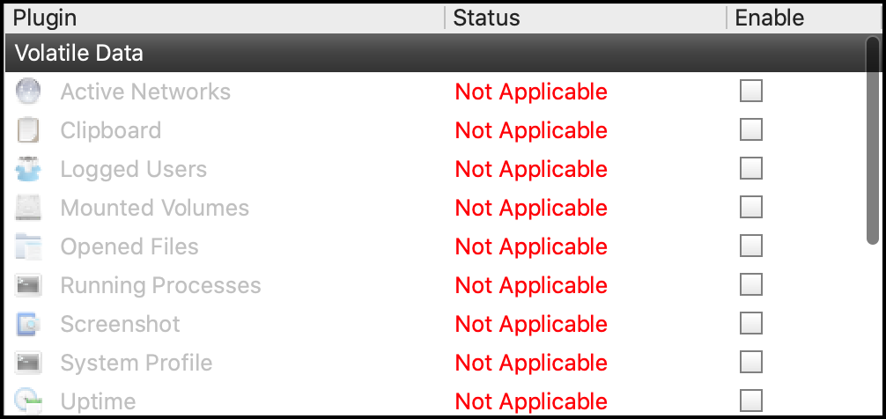

Be aware that Volatile Data collection is not possible when processing Mounted Media so these plugins will automatically be disabled.

## 19.2. Selecting the Time Zone

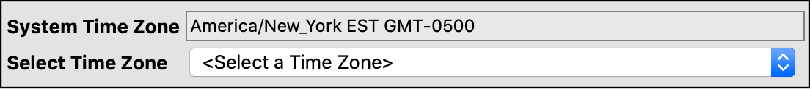

When possible, RECON ITR will detect the currently set System Time Zone which will be displayed.

To select a different time zone use the dropdown box next to **Select Time Zone**. The selected time zone will override the System Time Zone, if different, from what was detected.

## 19.3. Using Spotlight for Searching

All Macs since macOS 10.4 have a Spotlight index. This is a special index of Apple Extended Metadata that is used to locate files. RECON ITR provides the option of using the Spotlight index to speed up its processing.

To use Spotlight indices check the box next to **Use Spotlight**.

## 19.4. Selecting the Output Directory

The RECON ITR external drive can be used for the Output Directory. A new directory (or Case Folder) will be created for each case to keep data segregated.

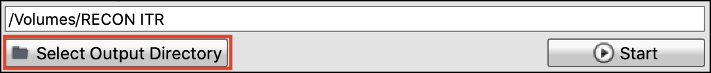

To select an output directory click the **Select Output Directory** button and navigate to the volume or location where the Case Folder is to be stored.

It is recommended to use an Apple native formatted volume (macOS Extended or APFS) for storing the case data.

## 19.5. Selecting Plugins

RECON ITR includes hundreds of plugins that parse thousands of artifacts automatically from macOS, Windows OS (Boot Camp), and iOS. The plugins are divided into various categories and will become active or inactive based on the Source selection or the macOS version that is detected.

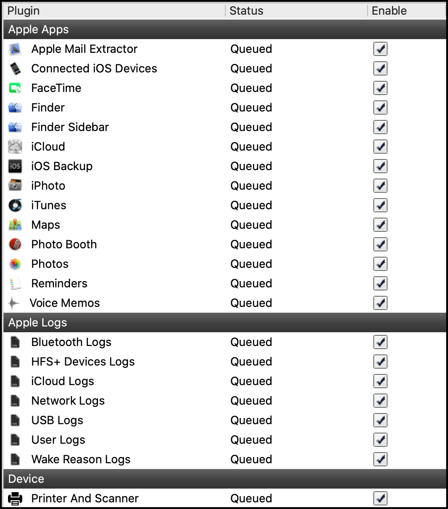

To begin parsing artifacts automatically, simply place a check next to the **Plugin** of interest in the **Enable** column.

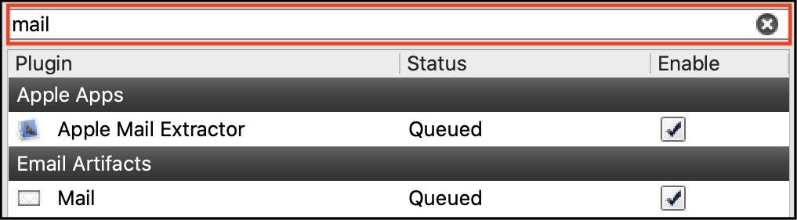

To filter the plugins quickly enter the plugin name in the Plugin Search box.

### 19.5.1. Plugin Templates

A template for plugins can be created by selecting any number of plugins.

Once the plugins have been chosen for the template click the **Save Template** checkbox and provide a unique name. Click the **Save Now** button to save the template.

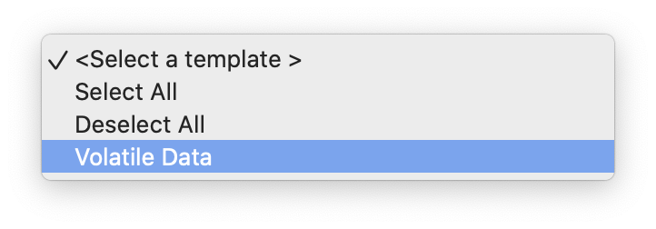

Once saved, the template will be available in the **&lt;Select a template&gt;** dropdown list above the Plugin Search box.

**Select All** and **Deselect All** templates are already included within the list.

## 19.6. Start the Processing

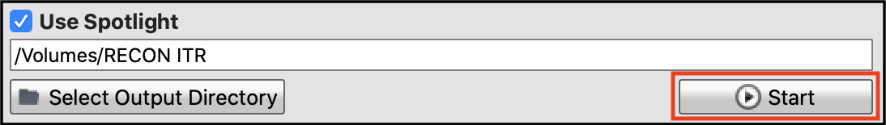

Once the New Case settings and options have been set click the **Start** button to begin the automated parsing and analysis of artifacts.

# 20. Results Viewer Interface

Once RECON ITR has completed processing, any parsed data will be loaded into the RECON ITR Results Viewer. The **Results Viewer** can be used to refine the data using search and filters.

## 20.1. Case Info

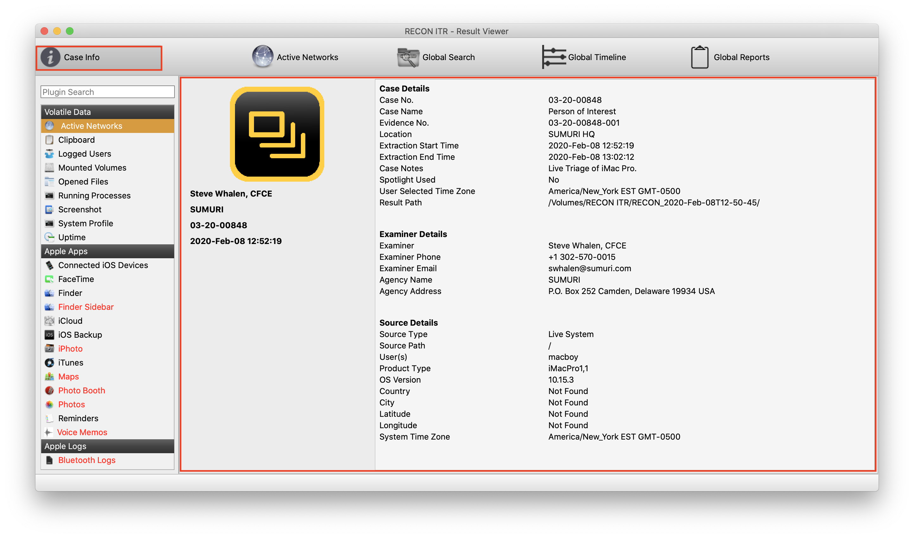

Information about the processed data can be found by selecting the **Case Info** button in the Results Viewer. The information can include Case Details, Examiner Details and Source Details.

The information included in the Case Info output is included in most reports generated by RECON ITR.

## 20.2. Detailed Information Pane

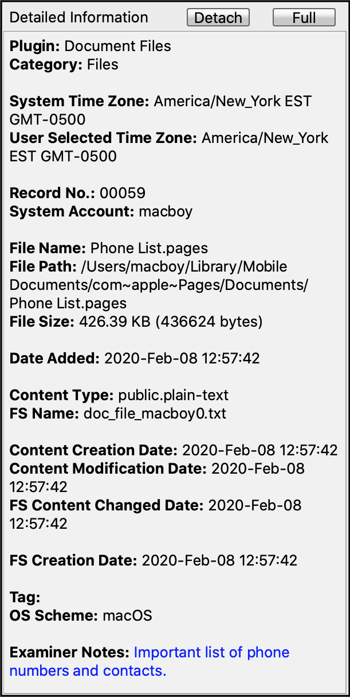

The **Detailed Information Pane** can be found on the right-side of the Results Viewer window.

The **Detailed Information Pane** is used to show additional information about any record selected in the Results Viewer window. The information will change based on the type of record that is selected.

The details of notes entered by an examiner can also be found in the Detailed Information Pane.

There are two options for detaching the Detailed Information Pane using the buttons at the top.

- **Detach Button** - Detaches the Detailed Information Pane. Information changes when new records are selected.
- **Full Button** - Detaches the Detailed Information Pane with the current record information only.

## 20.3. Preview Pane

The **Preview Pane** is a multimedia viewer and supports the preview of most audio, video and images. The Preview Pane will show content when a supported file is selected.

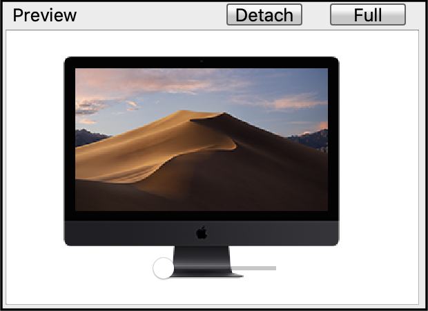

There are two options for detaching the Preview Pane using the buttons at the top.

- **Detach Button** - Detaches the Preview Pane. Information changes when new records are selected.
- **Full Button** - Detaches the Preview Pane with the current record information only.

## 20.4. Plugins Sidebar

The **Plugins Sidebar** is found on the left-side of the Results Viewer window. Plugins with **black text** contain artifacts found during parsing. Plugins with **red text** indicate that no artifacts were found.

Selecting a plugin will show the artifacts as records in the **Results Window** for further analysis.

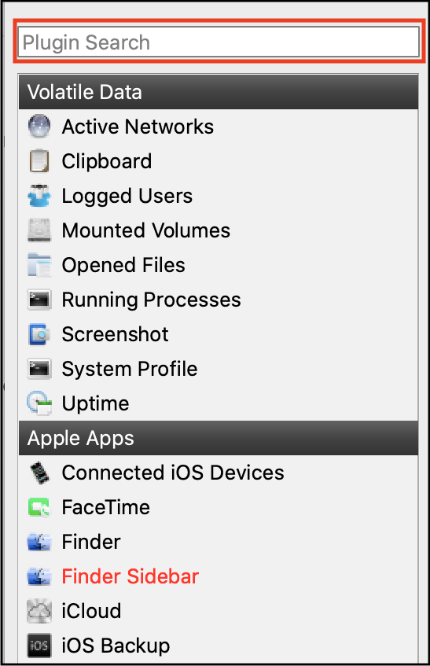

The Plugins Sidebar also has a Plugin Search box to filter and assist in finding plugins quickly.

# 21. Results Window

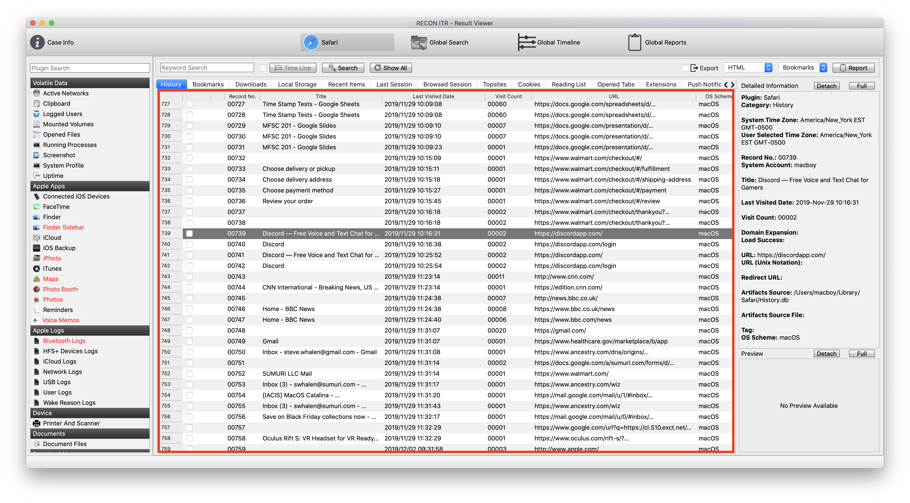

After the data has been processed selecting any plugin from the Plugin Sidebar will show records in the Results Window.

Records will have different tabs, columns and values based on the types of artifacts that were processed.

Selecting a different **Tab** will load new records. Keep in mind that not all tabs will be populated with Records.

If the screen is small the **navigation buttons** (to the right of the tabs) can be used to show additional tabs.

## 21.1. Keyword Search

Records can be filtered using the Results Window Search box. To filter the records in the Results Window type in a keyword into the **Search Box** and click the **Search** button.

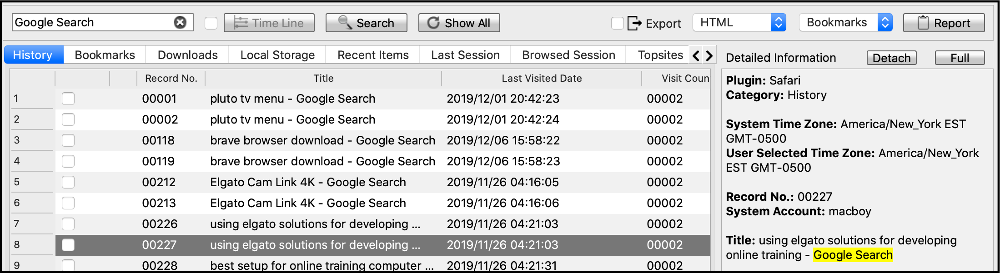

The records that match the typed keyword will be filtered and displayed. Additionally, the search term that was used will be highlighted in the Detailed Information Pane.

The filter using the search term will also be applied globally to all tabs within the active plugin.

To remove the filter click the **Show All** button.

To search by more than one keyword at the same time separate the keywords with a comma and no space.

## 21.2. Filter by Date Range with Time Line

Records in the Results Window can also be filtered to a specific date range using the Time Line filter. The Time Line filter will only be found with Plugins that have supported time stamps.

To filter to a specific date range check the box next to the **Time Line** button to activate. Click the **Time Line** button to set the **Start Time** and the **End Time** for the date range. Click the **Set** button to filter by the date range entered.

To remove the Time Line filter click the Show All button.

## 21.3. Bookmarking a Record

Bookmarking a record can help to identify items of interest. Reports can also be generated using bookmarks as a filter.

To bookmark any record click the checkbox to the left of the record or use the Spacebar on the keyboard when a record is highlighted.

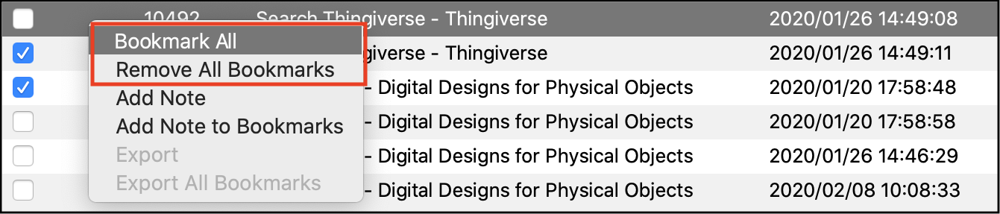

All records in the current Results Window can be bookmarked by right-clicking on a record and selecting **Bookmark All**. Likewise, all bookmarked records in the current Results Window can be removed by right-clicking and selecting **Remove All Bookmarks**.

## 21.4. Adding Notes to a Record

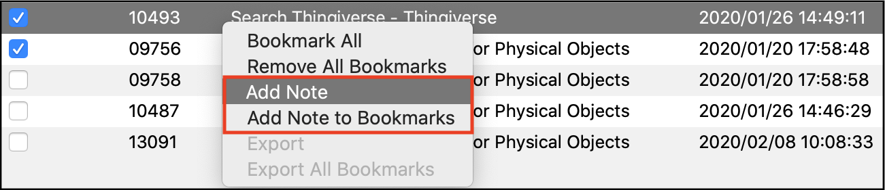

Examiner notes can be added to any record by right-clicking on a record and selecting **Add Note**. A note can also be added to all files bookmarked within the current Results Window by selecting **Add Note to Bookmarks**.

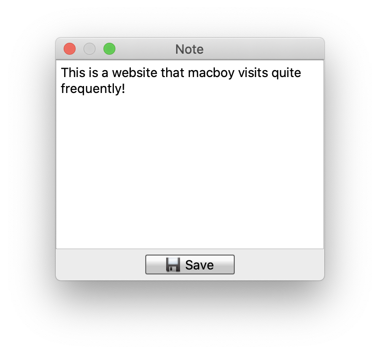

When the option to add a note is selected a window will appear to allow the note to be entered. To save the note with the record click the **Save** button.

Notes that are entered with records can be found in the record's Detailed Information pane and will be included in reports generated by the examiner.

## 21.5. Quick Look

Preview files content using the macOS native **Quick Look** functionality by clicking on the **Quick Look** button, using the hotkey **Option + Space Bar**, or right-click and select **Quick Look**.

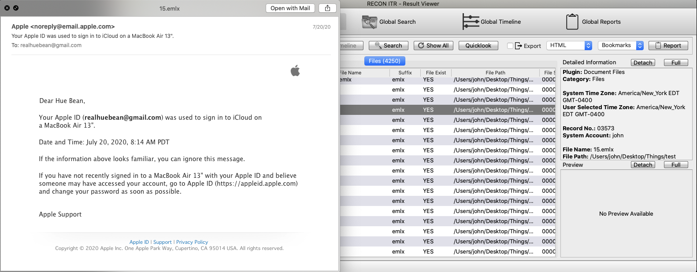

## 21.6. Viewing Apple Extended Metadata

If a file is accessible to RECON ITR its Extended Metadata can be viewed by using the keyboard combination **Command + M**.

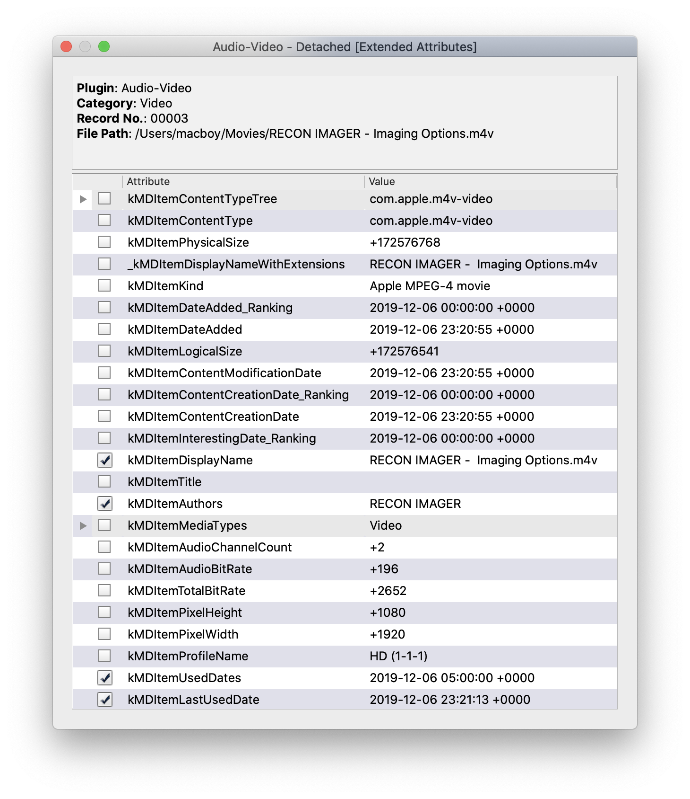

Extended Metadata can be bookmarked by selecting the checkbox next to the attribute of interest.

## 21.7. Exporting Files

Files that are accessible to RECON ITR can be exported (source has to be present).

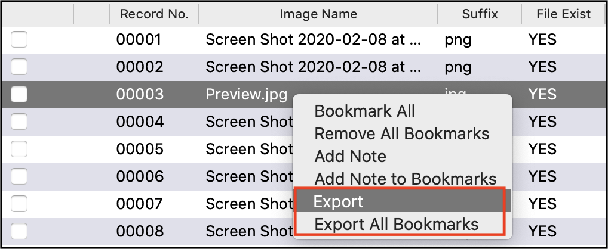

To export a file, right-click on the record of the file and select **Export**. It is also possible to export all of the current bookmarked files in the current Results Window by selecting **Export All Bookmarks**.

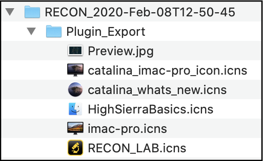

All exported files can be found in the Case Folder under **Plugin_Export**.

## 21.8. Plugin Reports

Reports can be created within any Plugin. Report options can be found in the upper right corner of the Results Window.

To export files at the same time the report is generated click the checkbox next to **Export**.

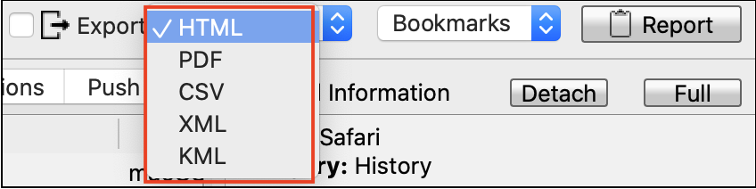

RECON ITR has the ability to create reports in five formats using the first dropdown list. Not all reporting formats will be available in all plugins. The five formats are:

- **HTML** - A report that can be opened in a standard web browser.
- **PDF** - A Portable Document Format report.
- **CSV** - A report saved as a Comma Separated Value spreadsheet.
- **XML** - A report saved in the Extensible Markup Language format for importing into other tools.
- **KML** - A report saved in the Keyhole Markup Language format for records containing geotags or location coordinates.

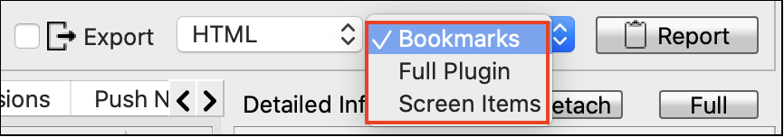

Three options exist for including records in the Plugin Report. These can be selected using the second dropdown list. The three options are:

- **Bookmarks** - Includes only the bookmarked records within the currently selected plugin
- **Full Plugin** - Includes all records in the currently selected plugin
- **Screen Items** - Includes all records currently showing in the Results Window

To generate the Plugin Report after all the options have been selected click **Report**.

A message will appear stating that the report was generated. To open the report click **YES**.

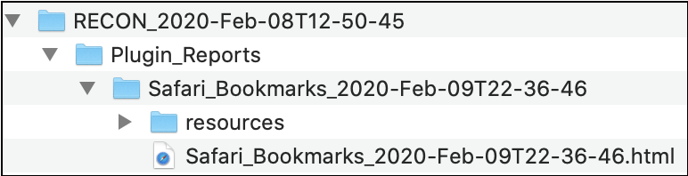

Plugin Reports can be found in the Case Folder under **Plugin_Reports**.

# 22. Global Search

RECON ITR can quickly find information across all Plugins within seconds using the Global Search module.

## 22.1. Using Keywords in Global Search

To start a search of all plugins click the **Global Search** icon found at the top of Results Viewer.

Enter a keyword for the search and click the search button. By default, the Global Search will return results across all plugins. To reset and start a new search click the **Clear** button.

Within seconds the Results Window will populate with search hits from across all plugins.

To search for multiple keywords at the same time enter the keywords separated with a comma and no space.

## 22.2. Bookmarking in Global Search

Bookmarking a record can help to identify items of interest. Reports can also be generated using bookmarks as a filter.

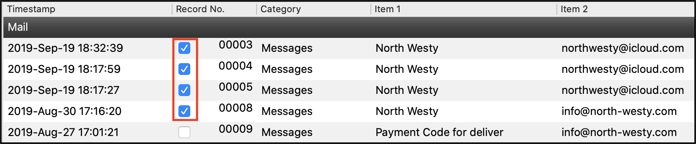

To bookmark any record click the checkbox next to the record when a record is highlighted.

All records in the current Results Window can be bookmarked by clicking the **Gold Star** button in the top right corner of the Global Search window. Likewise, all bookmarked records in the current Results Window can be removed by clicking the **Grey Star** button.

## 22.3. Viewing Detailed Information in Global Search

To display additional information about a result in the Global Results window, **double-click** on the record to activate the **Global Detailed Information & Preview** window.

## 22.4. Selecting Plugins in Global Search

In the upper left corner of the Global Search window there are Plugin options.

By default, the **All Plugins** options will be checked. The All Plugins option will search through all of the plugins where artifacts exist.

To limit the Global Search to specific plugins, select the **Plugin List** button.

A window will appear, allowing the selection of one or more plugins. Select the plugins to include in the Global Search and click **Save**. A Plugin Search box is available to quickly filter and find plugins to select. Only the plugins enabled will show results.

# 23. Global Timeline

All parsed artifacts with time stamps can be loaded within the Global Timeline Module to allow chronological analysis. Chronological, or historical, analysis enables the examiner to view data minute by minute or even second by second in order. The ability to place the artifacts in order by time can lead to a greater understanding of the case and can even change the outcome of an investigation.

## 23.1. Setting the Date Range in Global Timeline

By default, all records with time stamps and all plugins are used in the Global Timeline Module if no other options are selected.

To set the Date Range for the Global Timeline, change the values in the **From** and **To** calendars and click the **Set** button.

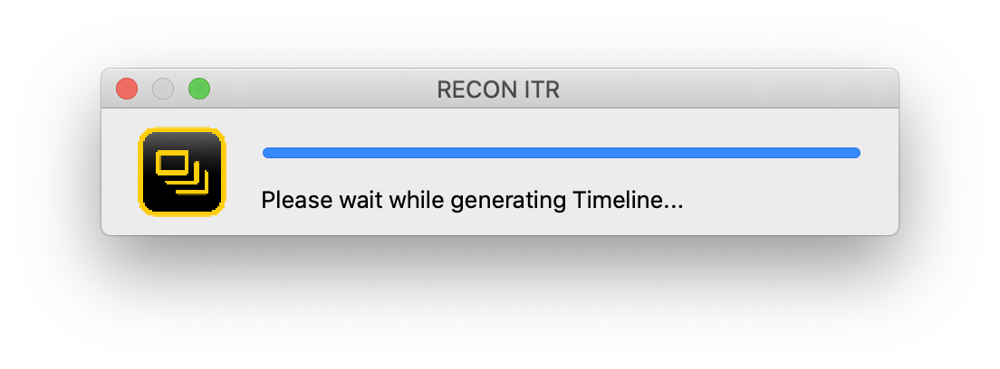

A message will display advising that the Timeline is being generated.

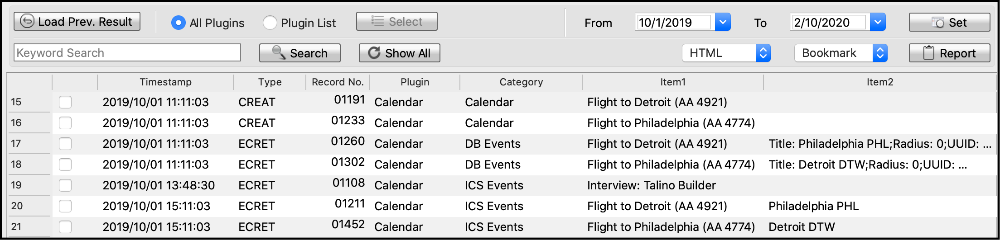

Once completed the results will be displayed in the Results Window.

## 23.2. Using Keywords in Global Timeline

Global Timeline results can be filtered using keywords.

Enter a keyword in the Search field and then click the **Search** button. To reset and start a new search click the **Show All** button.

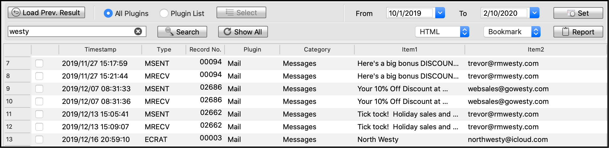

Within seconds the Results Window will populate with search hits from across all plugins.

To search for multiple keywords at the same time enter the keywords separated with a comma and no space.

## 23.3. Bookmarking in Global Timeline

Bookmarking a record can help to identify items of interest. Reports can also be generated using bookmarks as a filter.

To bookmark any record click the checkbox next to the record when a record is highlighted.

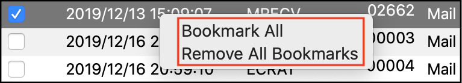

All records in the current Results Window can be bookmarked by right-clicking on any record in the Results Window and selecting **Bookmark All**. Likewise, all bookmarked records in the current Results Window can be removed by right-clicking on any record and selecting **Remove All Bookmarks**.

## 23.4. Viewing Detailed Information in Global Timeline

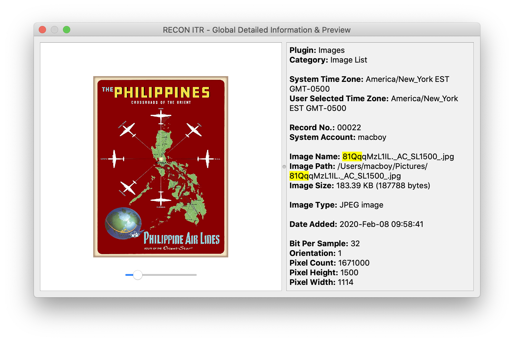

To display additional information about a result in the Global Timeline window, double-click on the record to activate the **Global Detailed Information & Preview** window.

## 23.5. Selecting Plugins in Global Timeline

In the upper left corner of the Global Timeline window are Plugin options.

By default, the **All Plugins** options will be checked. This option will search through all of the plugins that contain recovered artifacts.

To limit the Global Timeline to specific plugins, select the **Plugin List** button.

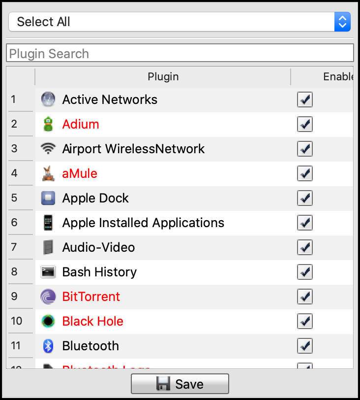

A window will appear, allowing the selection of one or more plugins. Select the plugins to include in the Global Timeline and click Save. A Plugin Search box is available to quickly filter and find plugins to select. Only the plugins enabled will show results.

# 24. Global Reports

A master report containing artifacts from all the plugins can be created with the **Global Report** Module.

To start creating a Global Report click the Global Report button found at the top of the RECON ITR Results Viewer.

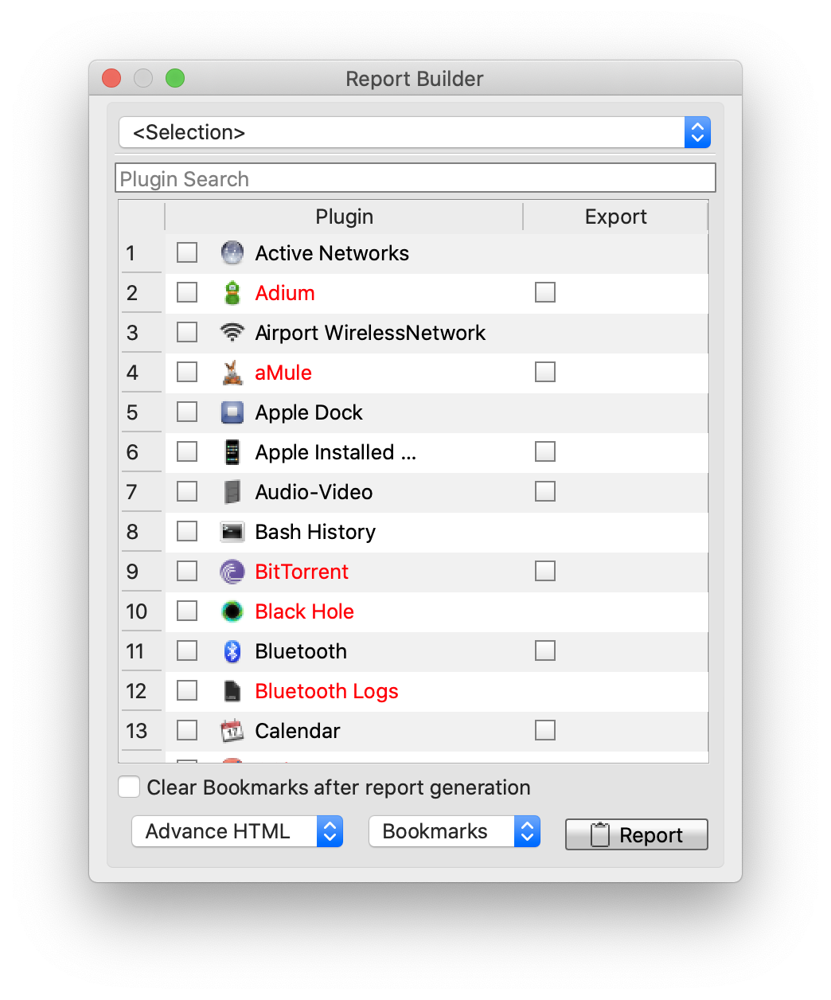

Select any plugins to be included in the report by checking the box within the **Plugin** column. To export files associated with the artifacts during the report creation check the **Export** button.

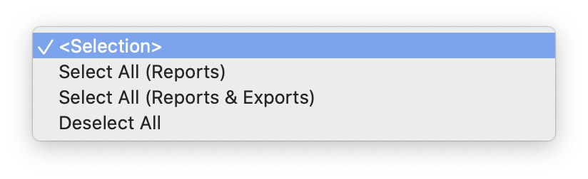

The dropdown list at the top of the Report Builder provides quick options for selecting all plugins, deselecting all plugins, and exporting files.

To filter plugins quickly use the **Plugin Search** box built-in to the Report Builder.

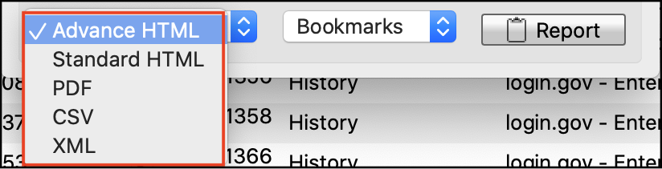

RECON ITR Global Report Module has the ability to create reports in five formats using the first dropdown list found at the bottom of the Report Builder. The five formats are:

- **Advanced HTML** - A report with extra navigation options that can opened in a standard web browser.
- **HTML** - A report that can be opened in a standard web browser.
- **PDF** - A Portable Document Format report.
- **CSV** - A report saved as a Comma Separated Value spreadsheet.
- **XML** - A report saved in the Extensible Markup Language format for importing into other tools.

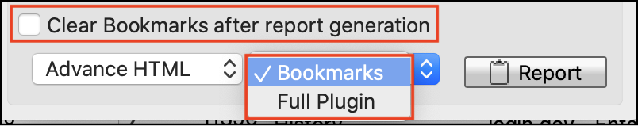

Two options exist for including records in Global Report and can be selected using the second dropdown list. The two options are:

- **Bookmarks** - Includes only the bookmarked records within the currently selected plugins.
- **Full Plugin** - Includes all records in the currently selected plugins.

To reset and clear all of the current bookmarks in RECON ITR when the Global Report is created click the **Clear Bookmarks after report generation box**.

To generate the Global Report after all the options have been selected click **Report**. There will be an option to select where the report will be saved.

Once the Global Report has been created and saved there will be an option to open the report.

# 25. Loading a Case

RECON ITR can reload data previously processed with the New Case Module. Keep in mind that the original data (source) will have to be present when reloading a case.

To load a previously processed case, click the **Load Case** button from the RECON ITR Welcome Screen.

Click the **Folder** icon to navigate to the RECON ITR Case Folder. Only select the root of the Case Folder.

## 25.1. Selecting the Time Zone

Once the Case Folder has been selected the **System Time Zone** of the processed data will be detected and displayed in the Load Case window.

By default RECON ITR will reload the case with the **Stored Time Zone** from when the case was first processed.

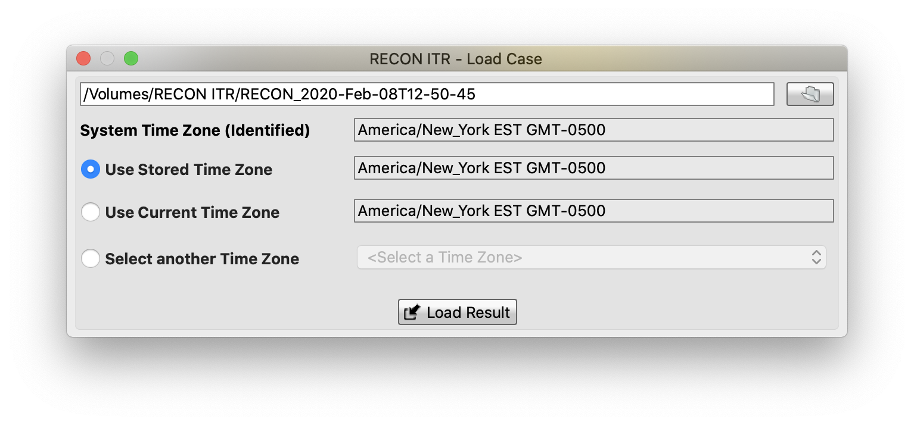

The case can be reloaded using the **Current Time Zone** of the computer or the examiner can **Select another Time Zone**.

Click the **Load Result** button to proceed to the Plugin Selection.

## 25.2. Plugin Selection

When reloading a case, the examiner has the option to load individual plugins or to select all plugins.

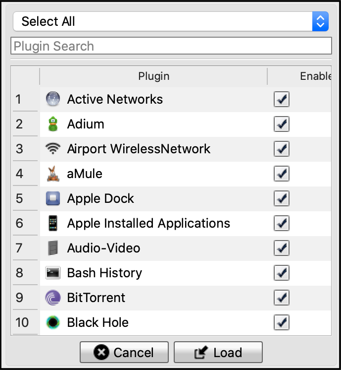

Once the plugins have been selected the case can be reloaded by clicking the Load button.

# 26. iOS Backups

RECON ITR can automatically detect and process unencrypted iOS Backup data found on the Mac being triaged.

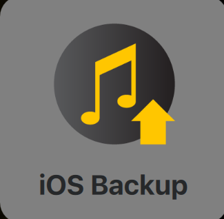

To start the search for iOS Backups click the iOS Backup button in the Sidebar of the RECON ITR Welcome Screen.

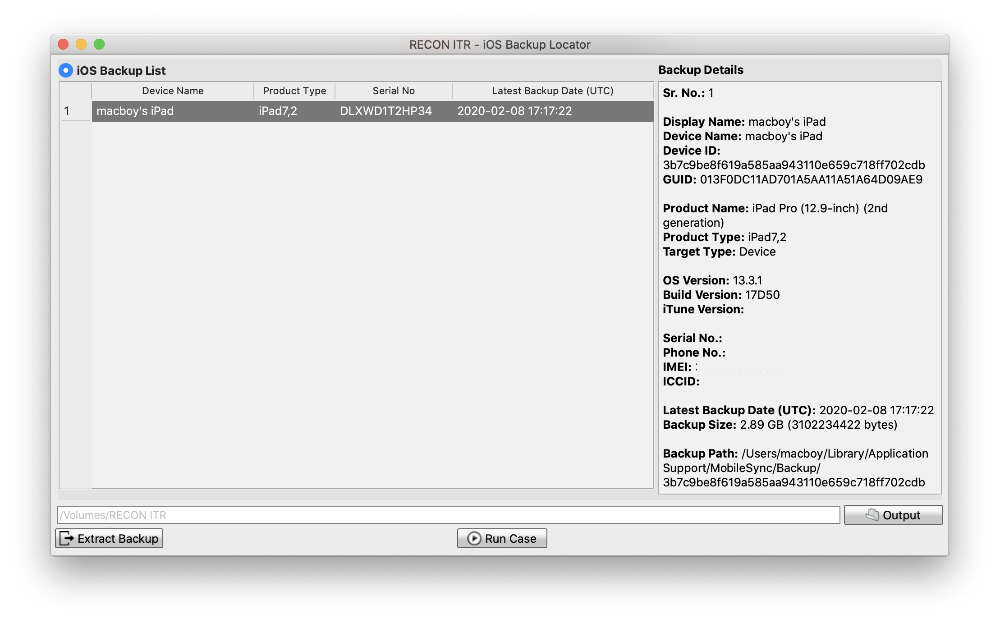

The iOS Backup Locator window will open listing any backups found. Full Disk Access permissions must be granted in order to locate iOS Backups.

Selecting an iOS Backup in the list will display the **Backup Details** in the right pane.

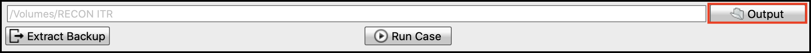

To begin the extraction process of iOS Backups, set the location of the Case Folder by clicking the **Output** button.

## 26.1. Extracting iOS Backups

Any iOS Backups located can be extracted. When the iOS Backups are extracted, RECON ITR automatically recreates the directory structure. The extracted and reconstructed iOS Backups can then be processed manually.

To extract the iOS Backup click the **Extract Backup** button.

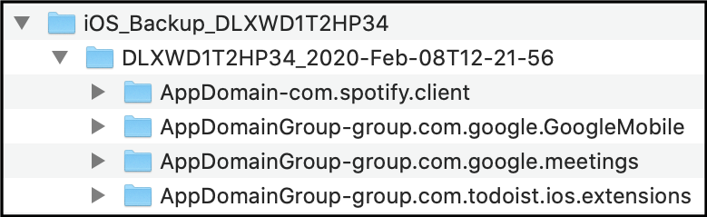

Navigate to the Output directory to find the reconstructed iOS Backup directories.

## 26.2. Processing iOS Backups

To process an iOS Backup that was located by RECON ITR select the backup from the list and click Run Case from the Backup Locator window.

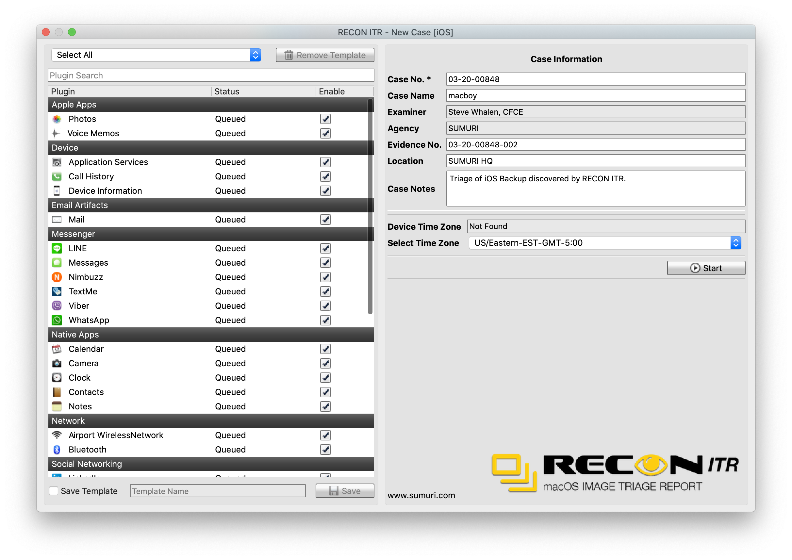

The RECON ITR **New Case** window will now open with plugins for iOS. Select the plugins of interest, enter the case information, set the Time Zone and click **Start**.

Please follow the instructions documented previously in this manual for triage and reporting.

# 27. File Search

RECON ITR has the ability to find files using file names, file content or file signatures on any source currently mounted using the **File Search** Module.

To begin a file search, click the **File Search** button found in the RECON ITR Sidebar to open the File Search window.

## 27.1. File Search Databases for Search Terms

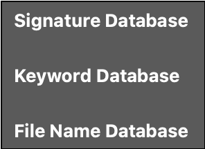

There are three databases that can be configured with search queries:

- **Signature Database** - Used to store a file's signature which is useful to find files that have no extensions or when a file extension has changed.
- **Keyword Database** - Used to store keywords for searching inside of a file's content (text inside the file itself).
- **File Name Database** - Used to store keywords that are used to find files based on their name or extension.

### 27.1.1. Signature Database Configuration

A category must be created before search terms can be added. To create a category click the **plus (+)** button underneath the **Category** column. Likewise, to remove a category click the **minus (-)** button or to edit a category click edit button (the pencil icon).

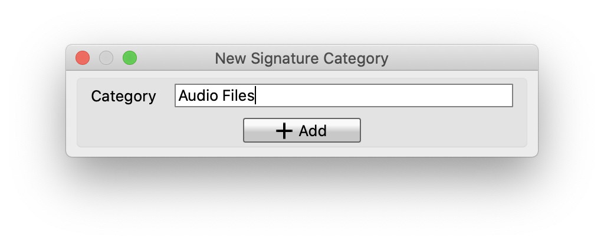

After clicking the plus (+) button, the **New Signature Category** window will open. Enter a name for the new category.

To add a new file signature select a category and click the **plus (+) button** underneath the File Signature pane to open the **New File Signature** window.

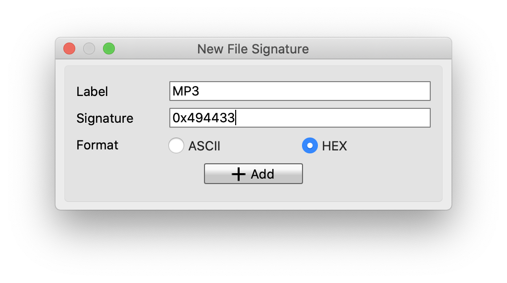

In the **New File Signature** window enter name of the signature in the Label field and the signature in either **ASCII** (text) or **HEX** (hexadecimal) format. To complete adding the new file signature click Add.

### 27.1.2. Keyword Database Configuration

A category must be created before search terms can be added. To create a category click the **plus (+)** button underneath the **Category** column. Likewise, to remove a category click the **minus (-)** button or to edit a category click edit button (the **pencil icon**).

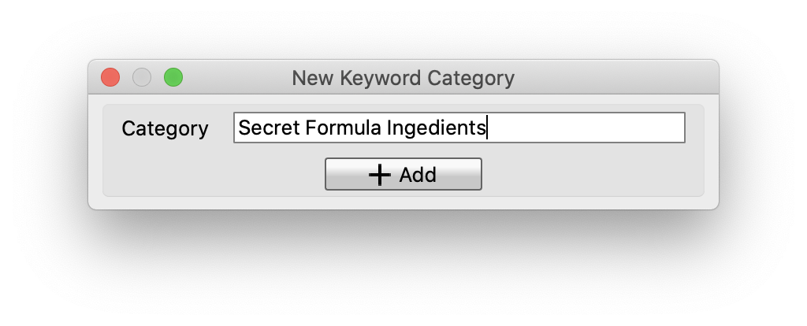

After clicking the plus (+) button the **New Keyword Category** window will open. Enter a name for the new category.

To add a new keyword select a category and click the plus (+) button underneath the File Keywords pane to open the **New Keyword** window.

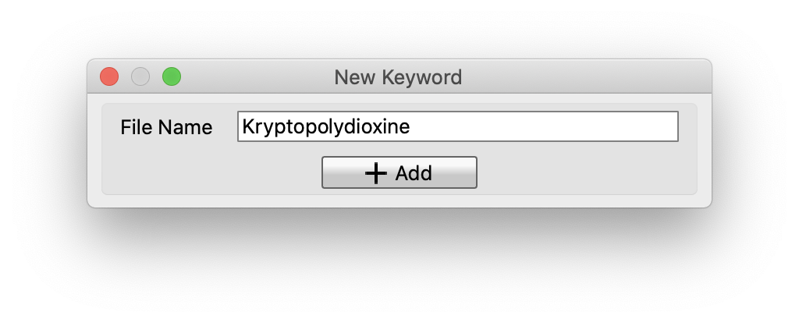

In the **New Keyword** window enter the name of the keyword in the **File Name** field. To complete adding the new keyword click **Add**.

To add a list of keywords all at the same time copy the keywords to the Clipboard and use the **Paste** button (clipboard icon). Make sure that there is only one keyword per line with one carriage return before pasting.

### 27.1.3. File Name Database Configuration

A category must be created before search terms can be added. To create a category click the **plus (+)** button underneath the **Category** column. Likewise, to remove a category click the **minus (-)** button or to edit a category click edit button (the **pencil icon**).

After clicking the plus (+) button the **New File Name Category** window will open. Enter a name for the new category.

To add a new keyword select a category and click the **plus (+)** button underneath the File Names pane to open the **New File Name** window.

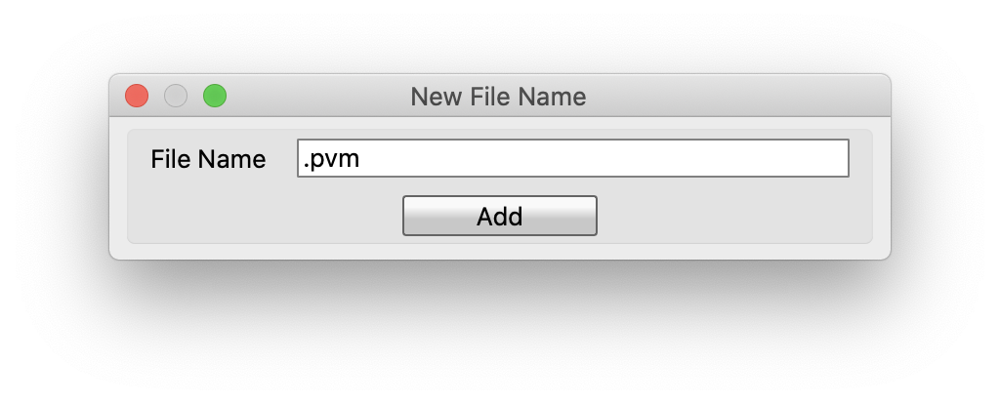

In the **New File Name** window enter the name of the keyword in the **File Name** field. To complete adding the new keyword click **Add**.

To add a list of keywords all at the same time copy the keywords to the Clipboard and use the **Paste** button (clipboard icon). Make sure that there is only one keyword per line with one carriage return before pasting.

## 27.2. Starting a File Search

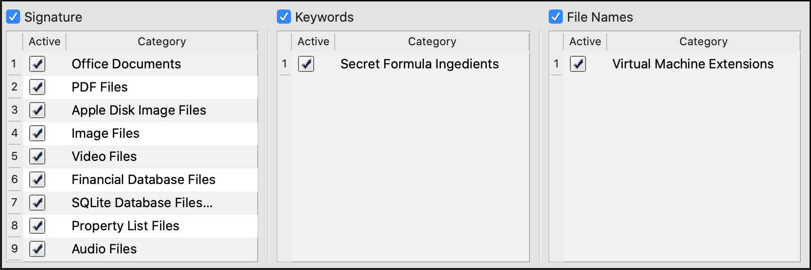

To begin a search for files, activate a category and select search terms of interest by clicking their checkboxes.

Optionally, set a **Start Date**, **End Date**, or both to filter the search by a date range in the **Timeline** pane.

Next, select the location to save the output by clicking the **folder icon**.

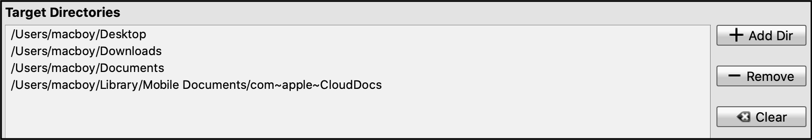

Add the directories to search by clicking the **Add Dir (+)** button in the **Target Directories** pane. Likewise, to remove a directory use the **Remove** button. To clear all the entries in the Target Directories window click the **Clear** button.

To use Spotlight for the search check the **Spotlight** checkbox.

To save the current settings for a future search activate the **Save Template** option, enter a name for the template and click **Save**.

To complete the search click the **Start** button.

## 27.3. Using Keywords in File Search

File Search results can be filtered using keywords.

Enter a keyword in the Search field and then click the **Search** button. To reset and start a new search click the **Show All** button.

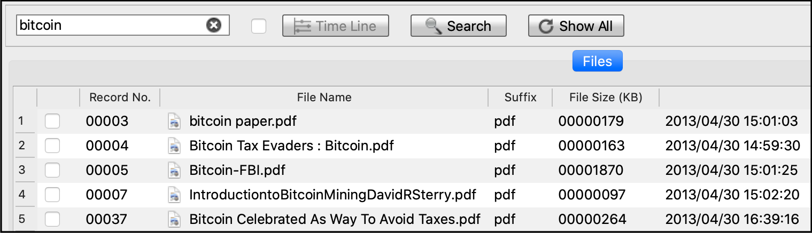

Within seconds the Results Window will populate with search hits

To search for multiple keywords at the same time enter the keywords separated with a comma and no space.

## 27.4. Bookmarking in File Search

Bookmarking a record can help to identify items of interest. Reports can also be generated using bookmarks as a filter.

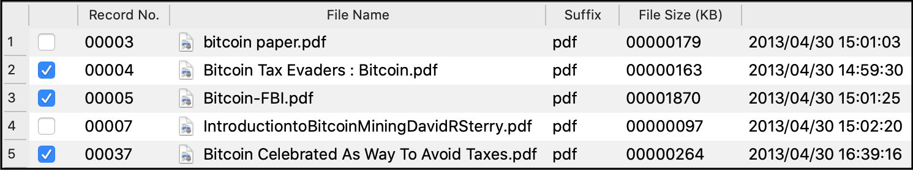

To bookmark any record click the checkbox next to the record when a record is highlighted.

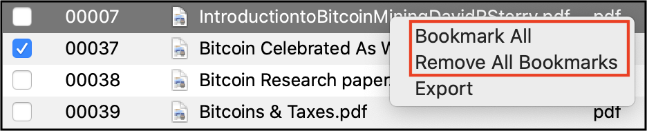

All records in the current Results Window can be bookmarked by right-clicking on any record in the Results Window and selecting **Bookmark All**. Likewise, all bookmarked records in the current Results Window can be removed by right-clicking on any record and selecting **Remove All Bookmarks**.

## 27.5. Filter by Date Range with Time Line

Records in the Results Window can also be filtered to a specific date range using the Time Line filter. The Time Line filter will only be found in Plugins that have supported time stamps.

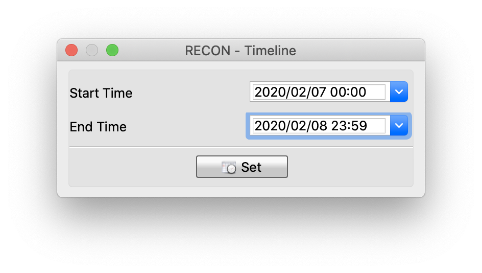

To filter to a specific date range, check the box next to the **Time Line** button to activate. Click the **Time Line** button to set the **Start Time** and the **End Time** for the date range. Click the **Set** button to filter by the date range entered.

To remove the Time Line filter click the **Show All** button.

## 27.6. Viewing Detailed Information in File Search

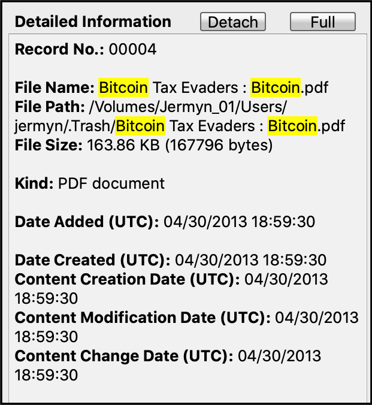

Additional information for any highlighted record will be displayed in the **Detailed Information Pane** found on the right side of the Results Window.

## 27.7. Generating Reports in File Search

Reports can be created within the File Search Viewer. Report options can be found in the upper right corner of the Results Window.

To export files at the same time the report is generated click the checkbox next to **Export**.

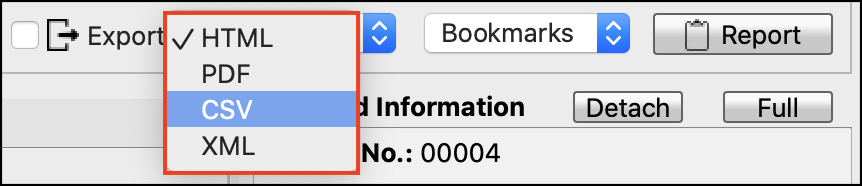

RECON ITR has the ability to create reports in four formats using the first dropdown list. Not all reporting formats will be available in all plugins. The four formats are:

- **HTML** - A report that can be opened in a standard web browser.
- **PDF** - A Portable Document Format report.
- **CSV** - A report saved as a Comma Separated Value spreadsheet.
- **XML** - A report saved in the Extensible Markup Language  format for importing into other tools.

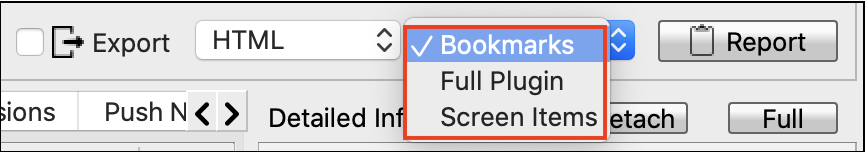

Three options exist for including records in File Search Report and can be selected using the second dropdown list. The three options are:

- **Bookmarks** - Includes only the bookmarked records within the currently selected plugin
- **Full Plugin** - Includes all records in the currently selected plugin
- **Screen Items** - Includes all records currently showing in the Results Window

To generate the File Search Report after all the options have been selected click **Report**.

A message will appear stating that the report was generated. To open the report click **YES**.

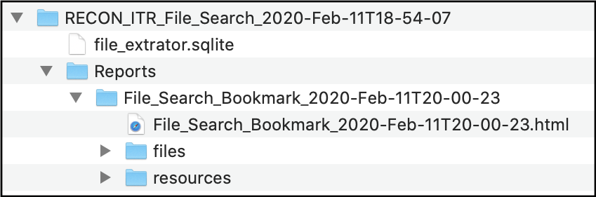

The File Search Report can be found in the Case Folder under **Reports**.

# 28. File Timeline

RECON ITR has the ability to create detailed file timelines using the File Timeline Module which can be launched from the RECON ITR Welcome Screen by clicking the **File Timeline** button.

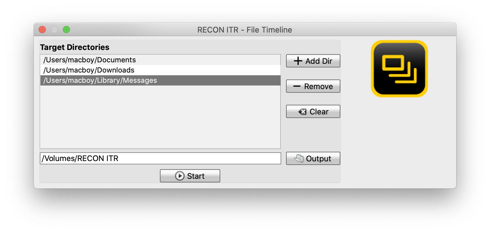

Once launched, the File Timeline window will open. Add directories to search by clicking the **Add Dir (+)** button in the **File Timeline** window. Likewise, to remove a directory use the **Remove (-)** button. To clear all the entries in the Target Directories window click the **Clear** button.

Select an **Output** directory and click **Start**.

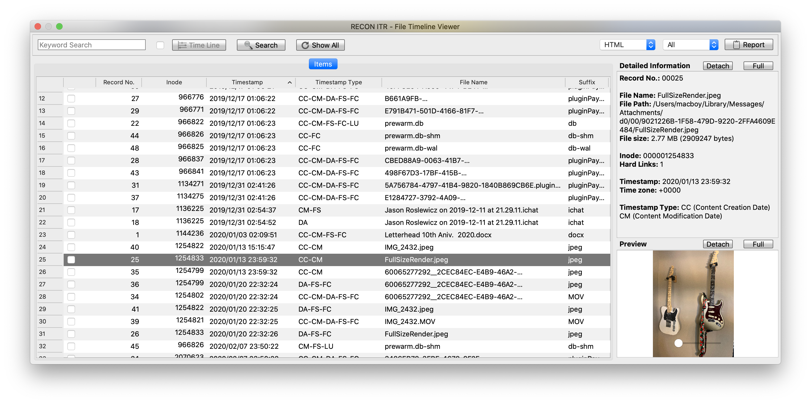

Once processing is completed RECON ITR will display all of the files in the File Timeline Viewer for further analysis or to generate reports.

## 28.1. Using Keywords in File Timeline Viewer

File Timeline results can be filtered using keywords.

Enter a keyword in the Search field and then click the **Search** button. To reset and start a new search click the **Show All** button.

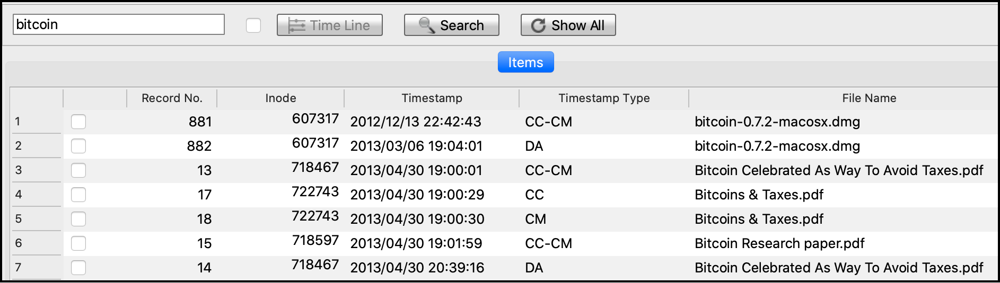

Within seconds the Results Window will populate with search hits.

To search for multiple keywords at the same time enter the keywords separated with a comma and no space.

## 28.2. Bookmarking in File Timeline Viewer

Bookmarking a record can help to identify items of interest. Reports can also be generated using bookmarks as a filter.

To bookmark any record click the checkbox next to the record when a record is highlighted.

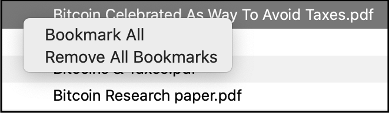

All records in the current Results Window can be bookmarked by right-clicking on any record in the Results Window and selecting **Bookmark All**. Likewise, all bookmarked records in the current Results Window can be removed by right-clicking on any record and selecting **Remove All Bookmarks**.

## 28.3. Filter by Date Range with Time Line

Records in the Results Window can also be filtered to a specific date range using the Time Line filter. The Time Line filter will only be found in Plugins that have supported time stamps.

To filter to a specific date range check the box next to the **Time Line** button to activate. Click the **Time Line** button to set the **Start Time** and the **End Time** for the date range. Click the **Set** button to filter by the date range entered.

To remove the Time Line filter click the **Show All** button.

## 28.4. Viewing Detailed Information in File Search

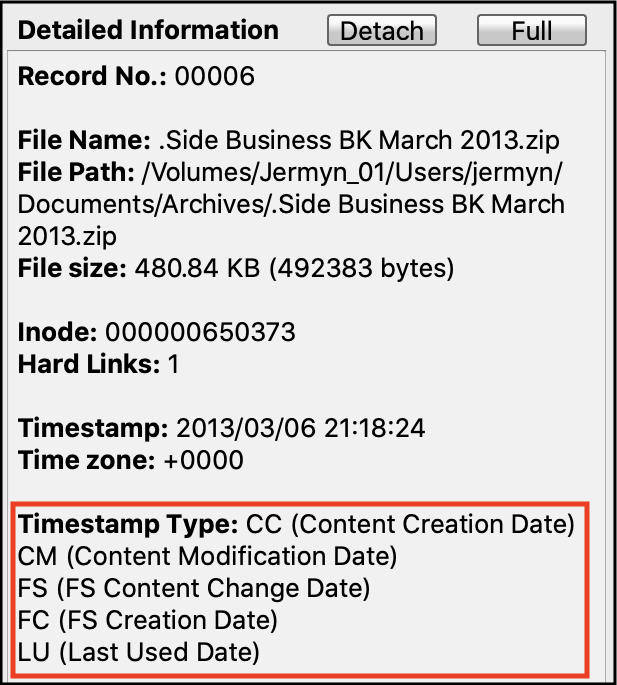

Additional information for any highlighted record will be displayed in the **Detailed Information Pane** found on the right side of the Results Window.

The Detailed Information Pane will also contain a legend for the **Timestamp Type** used in the results.

## 28.5. Generating Reports in File Timeline

Reports can be created within the File Timeline Viewer. Report options can be found in the upper right corner of the Results Window.

To export files at the same time the report is generated click the checkbox next to Export.

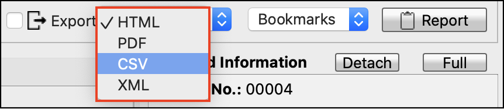

RECON ITR has the ability to create reports in four formats using the first dropdown list. Not all reporting formats will be available in all plugins. The four formats are:

- **HTML** - A report that can be opened in a standard web browser.
- **PDF** - A Portable Document Format report.
- **CSV** - A report saved as a Comma Separated Value spreadsheet.
- **XML** - A report saved in the Extensible Markup Language  format for importing into other tools.

Three options exist for including records in File Timeline Report and can be selected using the second dropdown list. The three options are:

- **Bookmarks** - Includes only the bookmarked records within the currently selected plugin
- **Full Plugin** - Includes all records in the currently selected plugin
- **Screen Items** - Includes all records currently showing in the Results Window

To generate the File Search Report after all the options have been selected click **Report**.

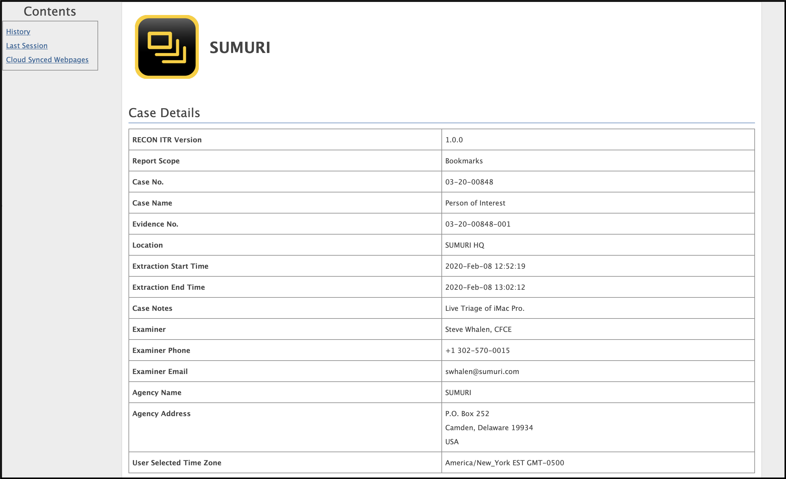

A message will appear stating that the report was generated. To open the report click **YES**.

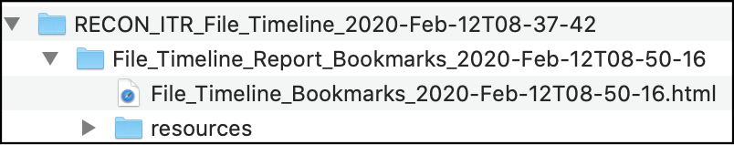

The File Timeline Report can be found in the Case Folder under **Reports**.

# 29. Collecting Logs

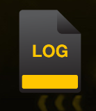

RECON ITR has the ability to collect Unified Logs from live running Macs. To begin click the **Log Collect** button found in the Sidebar of the RECON ITR Welcome Screen.

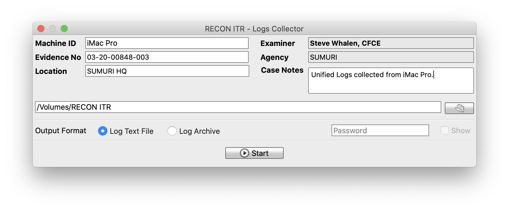

Once selected, the RECON ITR Logs Collector window will appear. Enter the case information in the top fields. Note that the Machine ID is a required field.

Next, set the Output directory by clicking the **Folder** icon keeping in mind that Mac logs can be 10 GBs or more in size.

## 29.1. Collecting Logs as Text

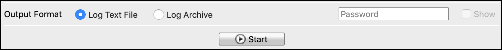

Collecting Mac logs as text does not require a password. Select **Log Text File** for the Output Format and click **Start**.

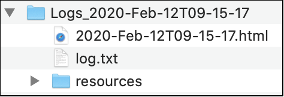

The text logs and report will be found in the Case Folder when complete.

## 29.2. Collecting Logs as a Log Archive

Collecting Mac logs as a log archive **does** require entering the Admin password for the current user. Select **Log Archive** for the Output Format and click **Start**.

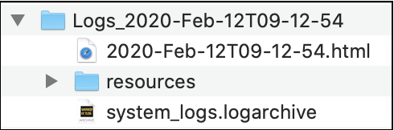

The Log Archive file and report will be found in the Case Folder when complete.

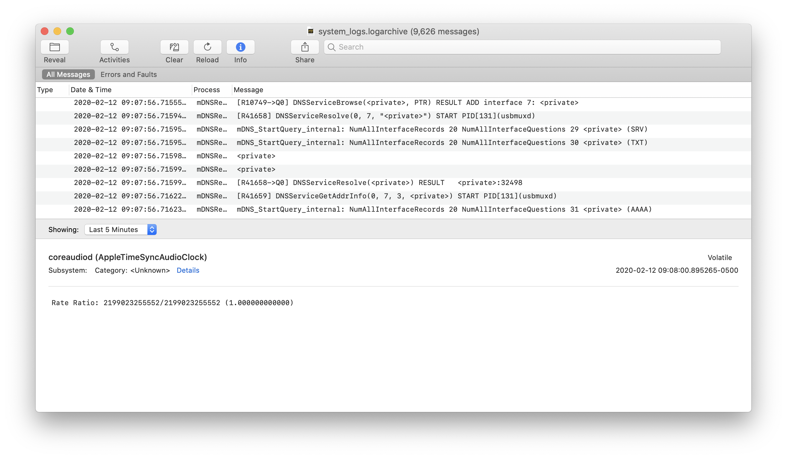

The Log Archive file can be opened with the Console viewer included with macOS.

# 30. Collecting Mac Logs from RAM

**RAM Imaging has been depreciated in the current versions of RECON ITR** due to Apple's Notarization process.

Apple requires software to be notarized in order to run on newer versions of macOS. Software that does not comply to their guidelines will be labelled malicious and prevented from being ran.

In order to be notarized, software cannot utilize certain Kernel Extensions, including those that are needed for RAM acquisition. Due to this, the RAM Imager needed to be removed for our software to be compliant.

However, RECON ITR version 1.0.0 (only) includes the RAM Imager which still works for Macs running macOS 10.13 and below.

We do not recommend downgrading your RECON ITR for this feature. We instead recommend using RECON IMAGER's built-in RAM Imager feature.

Important: Imaging Mac RAM is not guaranteed to work and can cause a Kernel panic which can lock up or restart the system. Imaging Mac RAM should be done last in the collection process.

RECON ITR has the ability to collect logs from live running Macs if the admin password is known for the current user.

To begin, click the RAM Imager button found in the Sidebar of the RECON ITR Welcome Screen.

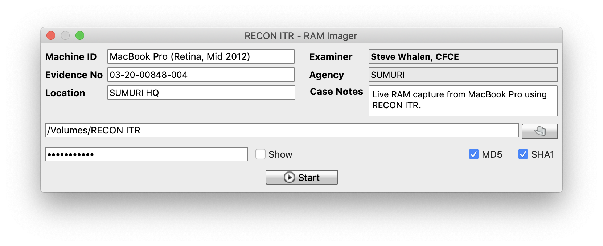

The RECON ITR **RAM Imager** window will appear. Enter the case information in the top fields. Note that the Machine ID is a required field.

Next, set the Output directory by clicking the **Folder** icon keeping in mind that Mac RAM output will be larger than what the Mac shows when the RAM is uncompressed.

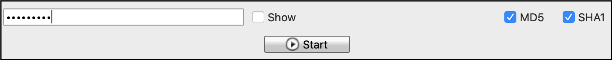

Enter the **password** for the current user (must be an Admin), select the hashing options (**MD5/SHA1**) and click Start to image RAM.

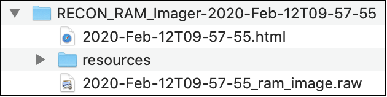

Upon completion the RAM image in RAW format and the RAM imaging report can be found in the Case Folder.

# 31. Disk Manager

The RECON ITR Disk Manager displays internal and external disk and volumes including other Macs connected in Target Disk Mode. Disk Manager uses Mac native libraries to fully support Mac technologies such as FileVault, Core Storage, APFS, macOS Extended and more.

RECON ITR Disk Manager includes a built-in write blocker to allow the connection of external devices (including Macs in Target Disk Mode) in a forensically sound manner.

Important: If a device requires write-protection do not connect the device or Mac until **Disk Arbitration** is disabled.

To start the **Disk Manager** click the Disk Manger button found in the Sidebar of the RECON ITR Welcome Screen.

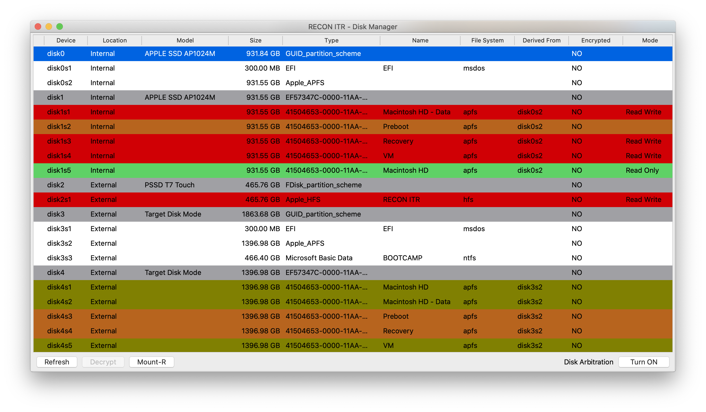

Upon launch the Disk Manager window will appear showing internal and external disks and volumes. Additionally, any Macs connected via Target Disk Mode will be displayed.

Full documentation and instructions for using the Disk Manager can be found in the RECON IMAGER manual found in the **Disk Manager section**

## 31.1. Enable/Disable Disk Arbitration for Write Blocking

RECON ITR has built-in **write-blocking** to prevent any changes to a device when it is connected to the examination Mac. This is done by controlling the native macOS Disk Arbitration daemon.

To turn off Disk Arbitration click the **Turn OFF** button in the bottom right-hand corner of the Disk Manager window. After a few seconds, Disk Arbitration will be disabled and devices can be safely connected to the examiner Mac without mounting for triage and imaging.

When you have completed the triage or imaging of the connected devices Disk Arbitration can be turned back on by clicking the Disk Arbitration **Turn ON** button. Make sure to unmount or remove any devices connected before enabling Disk Arbitration.

# 32. Tutorial - Connecting an Intel Mac in Target Disk Mode for Imaging

This tutorial will show how to safely connect an **Intel Mac** in Target Disk Mode with write-protection to create a forensic image.

Target Disk Mode was ruled out with the new Apple Silicon Macs and replaced with a new **Sharing Mode**.

The following equipment and setup will be used for this tutorial:

- **Examiner Mac** - iMac Pro (2017) running macOS 10.15.3 (Catalina) with RECON ITR
- **Target Mac** - 2019 MacBook Pro 16" running macOS 10.15.3 (Catalina) with FileVault On
- **Connection** - Thunderbolt 3 cable

**Step-1** - On the Examiner Mac, make sure that RECON ITR has been granted Full Disk Permissions.

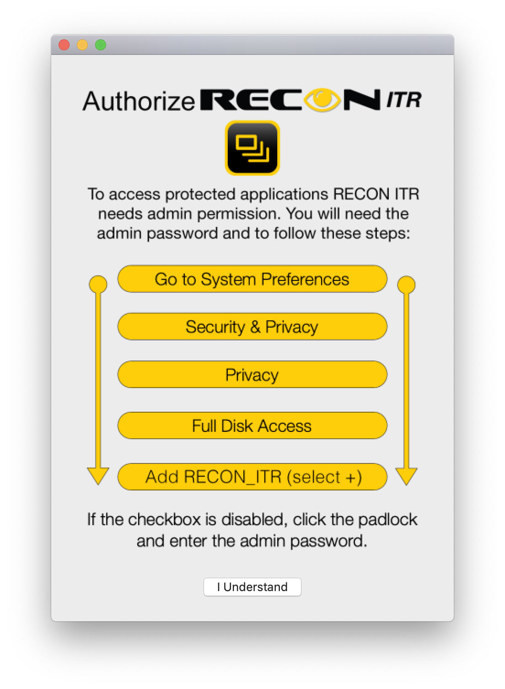

**Step-2** - Start RECON ITR.

**Step-3** - Put the Target Mac into Target Disk Mode by holding down its "T" key when starting. It is in Target Disk Mode when the Thunderbolt and USB symbols are showing on the screen.

**Step-4** - Open the Disk Manager from the RECON ITR Welcome Screen.

**Step-5** - Turn Off Disk Arbitration (bottom right-hand corner) to enable write-blocking.

**Step-6** - Connect the Thunderbolt cable to the Target Mac port and then to the Examiner Mac.

**Step-7** - When prompted, type in a password for an Admin user on the Target Mac and wait for a few seconds. The first entry of the password has been known to fail. If required, type the password again.

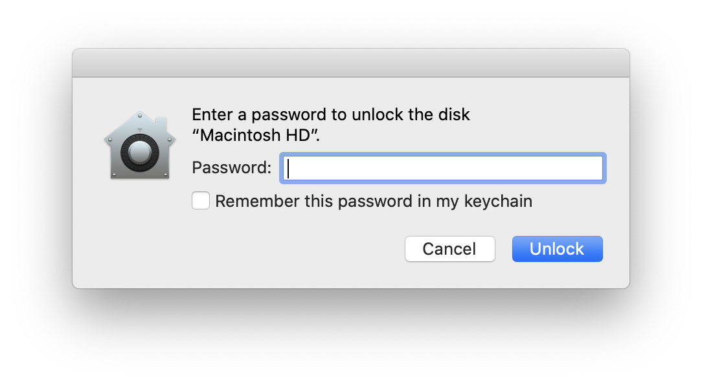

**Step-8** - Click the **Refresh** button in the Disk Manager to re-poll the devices and look for the Mac connected in Target Disk Mode.

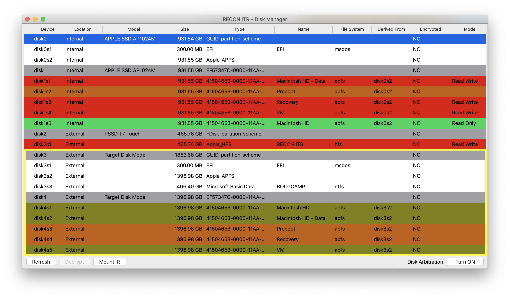

**Step-9** - Start **RECON IMAGER** from the RECON ITR Welcome Screen.

**Step-10** - Type in the password for the current user for the Examination Mac when prompted.

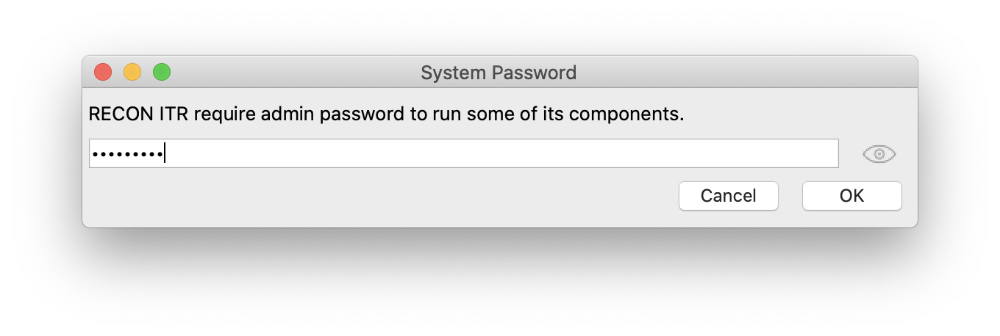

**Step-11** - Using RECON IMAGER Disk Imager select the source which is usually one of the Macintosh HD partitions. Chose the image type and select the Destination. Provide an Image Name and any case information.

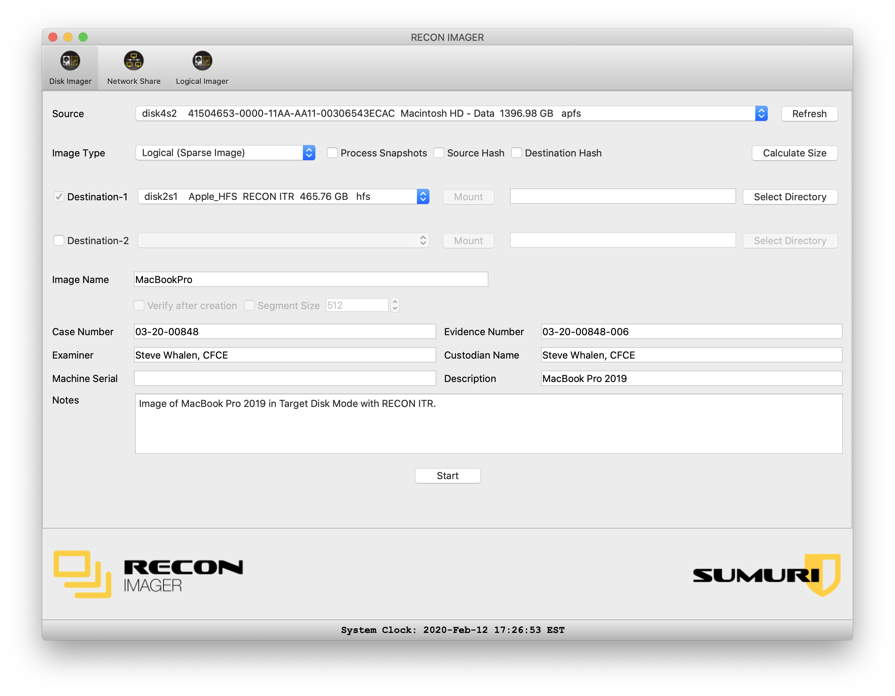

**Step-12** - Click Start to image.

# 33. Renewing RECON ITR

RECON ITR comes with one full year of support and updates. Once RECON ITR expires, its license will need to be renewed in order to continue to receive updates and support.

RECON ITR can be renewed online via our website here: <https://sumuri.com/product/recon-itr-renewal/>

Additionally, RECON ITR can be renewed by contacting our office to be assisted by a team member (see the **Getting Support section** of this manual).

## 33.1. Applying RECON ITR Renewed License

After purchasing an additional year of annual maintenance, a team member will send an email with an attachment and instructions on updating the RECON ITR License.

To update the license on the RECON ITR SSD drive, start by downloading and extracting the .zip file attached to the renewal email.

By extracting the zip file, you should have a folder named the "Your Name_serialnumber".

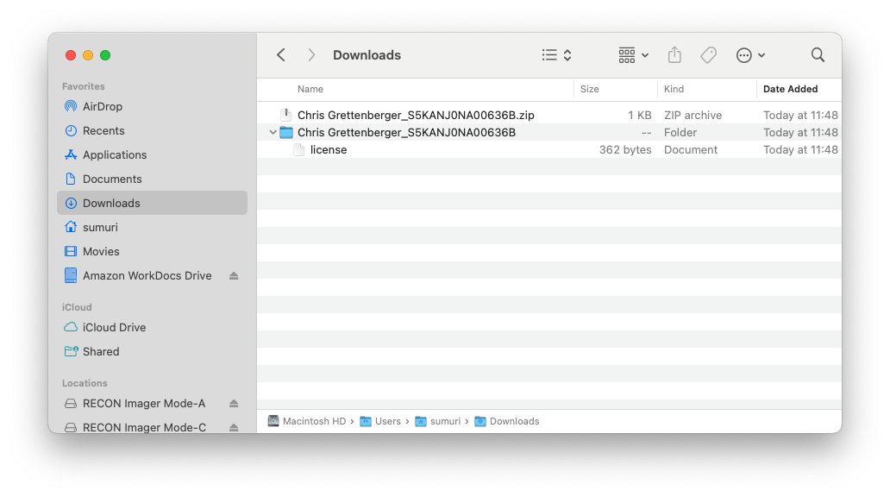

Select the file titled 'license' inside your unzipped folder, then copy and paste this file to each partition on your RECON ITR SSD and hit replace when prompted.

- RECON ITR
- RECON IMAGER Mode-A
- RECON IMAGER Mode-B
- RECON IMAGER Mode-C
- RECON IMAGER Mode-D
- RECON IMAGER Mode-M

Once you've replaced each license file with your newly downloaded copy, your RECON ITR license should be fully updated.

# 34. Training

SUMURI offers vendor-neutral training on Mac Forensics. SUMURI's courses teach the concepts and knowledge to use RECON ITR (or other tools) to process Mac artifacts and Mac file systems.

- [Best Practices In Mac Forensics (MFSC-101)](https://sumuri.com/mac-training/mfsc-101/)
- [Advanced Practices In Mac Forensics (MFSC-201)](https://sumuri.com/mac-training/mfsc-201/)

If interested in hosting a training course at your location and receiving up to two free seats please contact us via the link below.

- [Hosting SUMURI Training](https://sumuri.com/host-training/)

# 35. Getting Support

Support for RECON ITR is available via our Online Support site and submitting a ticket here: <https://helpdesk.sumuri.com>

During regular business hours, we strive to respond in less than one hour but no longer than 24 hours.

SUMURI is based in the state of Delaware, USA (Eastern Time Zone – EST/EDT).

Our office hours are 0900-1700 (9:00 a.m. – 5:00 p.m.). SUMURI is closed for [US Federal Holidays](https://en.wikipedia.org/wiki/Federal_holidays_in_the_United_States).

For comments or feature requests, please email us at: <mailto:hello@sumuri.com>

## 35.1. Law Enforcement Emergency Support

If you are law enforcement, and are in need of immediate emergency assistance with any of our products, please contact us anytime at [+1 (302) 570-0015](tel: +13025700015).

# 36. Change Logs

Change Logs for RECON IMAGER can be found by selecting the **License Agreement** icon in the Main Menu then selecting the **Change Logs** tab.

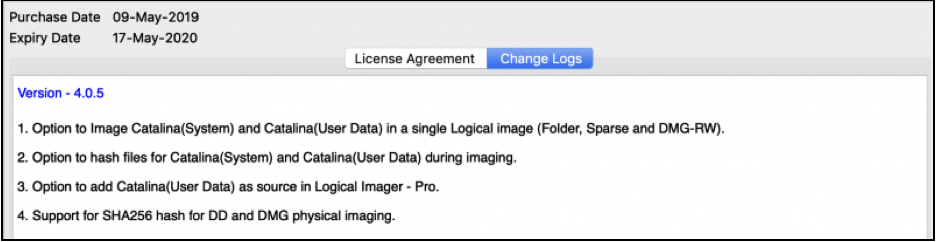

# 37. Terms and Conditions

**RECON ITR/IMAGER**

**Copyright 2023 – SUMURI LLC**

<http://www.sumuri.com>

**IMPORTANT, PLEASE READ CAREFULLY. THIS IS A LICENSE AGREEMENT**

This **RECON ITR/IMAGER** is protected by copyright laws and international copyright treaties, as well as other intellectual property laws and treaties. This **RECON ITR/IMAGER**  is licensed, not sold.

## 37.1. End User License Agreement

This End User License Agreement ('**EULA**') is a legal agreement between you (either an individual or a single entity) and **SUMURI LLC** ([www.sumuri.com](http://www.sumuri.com)) with regard to the copyrighted software (herein referred to as **RECON ITR/IMAGER**  or 'software') provided with this **EULA**. The **RECON ITR/IMAGER**  includes computer software, the associated media, any printed materials, and any 'online' or electronic documentation. Use of any software and related documentation ('software') provided to you by **RECON ITR/IMAGER**  in whatever form or media, will constitute your acceptance of these terms, unless separate terms are provided by the software supplier, in which case certain additional or different terms may apply. If you do not agree with the terms of this **EULA**, do not download, install, copy or use the software. By installing, copying or otherwise using the **RECON ITR/IMAGER**, you agree to be bound by the terms of this **EULA**. If you do not agree to the terms of this **EULA**, **SUMURI LLC** is unwilling to license the **RECON ITR/IMAGER** to you.

**Eligible License** – This software is available for license solely to software owners, with no right of duplication or further distribution, licensing, or sub-licensing.

**License Grant** – **SUMURI LLC** grants to you a personal, non-transferable and non-exclusive right to use the copy of the software provided with this **EULA**. You agree you will not copy or duplicate the software. You agree that you may not copy the written materials accompanying the software. Modifying, translating, renting, copying, transferring or assigning all or part of the software, or any rights granted hereunder, to any other persons and removing any proprietary notices, labels or marks from the software is strictly prohibited. Furthermore, you hereby agree not to create derivative works based on the software. You may not transfer this software.

**Copyright** –  The software is licensed, not sold. You acknowledge that no title to the intellectual property in the software is transferred to you. You further acknowledge that title and full ownership rights to the Software will remain the exclusive property of **SUMURI LLC** and/or its suppliers, and you will not acquire any rights to the software, except as expressly set forth above. All copies of the software will contain the same proprietary notices as contained in or on the software. All title and copyrights in and to the **RECON ITR/IMAGER**  (including but not limited to any images, photographs, animations, video, audio, music, text and "applets," incorporated into the **RECON ITR/IMAGER**), the accompanying printed materials, and any copies of the **RECON ITR/IMAGER**, are owned by **SUMURI LLC**. The **RECON ITR/IMAGER** is protected by copyright laws and international treaty provisions. You may not copy the printed materials accompanying the **RECON ITR/IMAGER**.

**Reverse Engineering** – You agree that you will not attempt, and if you are a corporation, you will use your best efforts to prevent your employees and contractors from attempting to reverse compile, modify, translate or disassemble the software in whole or in part. Any failure to comply with the above or any other terms and conditions contained herein will result in the automatic termination of this license and the reversion of the rights granted hereunder to **SUMURI LLC**.

**Disclaimer of Warranty** – The software is provided 'AS IS' without warranty of any kind. **SUMURI LLC** and its suppliers disclaim and make no express or implied warranties and specifically disclaim the warranties of merchantability, fitness for a particular purpose and non-infringement of third-party rights. The entire risk as to the quality and performance of the software is with you. Neither **SUMURI LLC** nor its suppliers warrant that the functions contained in the software will meet your requirements or that the operation of the software will be uninterrupted or error-free. **SUMURI LLC** is not obligated to provide any updates to the software for any user who does not have a software maintenance subscription.

**Limitation of Liability** – **SUMURI LLC**'s entire liability and your exclusive remedy under this **EULA** shall not exceed the price paid for the software, if any. In no event shall **SUMURI LLC** or its suppliers be liable to you for any consequential, special, incidental or indirect damages of any kind arising out of the use or inability to use the software, even if **SUMURI LLC** or its supplier has been advised of the possibility of such damages, or any claim by a third party.

**Rental** – You may not loan, rent, or lease the software.

**Transfer** – You may not transfer the software to a third party without written consent from **SUMURI LLC** and written acceptance of the terms of this Agreement by the transferee. Your license is automatically terminated if you transfer the software without the written consent of **SUMURI LLC**. You are to ensure that the software is not made available in any form to anyone not subject to this Agreement. A transfer fee of $150 USD will be charged to transfer the software (not applicable to transfers associated with orders from distributors, or resellers or intra-company transfers).

**Upgrades** – If the software is an upgrade from an earlier release or previously released version, you now may use that upgraded product only in accordance with this **EULA**. If the **RECON ITR/IMAGER** is an upgrade of a software program which you licensed as a single product, the **RECON ITR/IMAGER** may be used only as part of that single product package and may not be separated for use on more than one computer.

**OEM Product Support** – Product support for the **RECON ITR/IMAGER** is provided by **SUMURI LLC**. For product support, please call **SUMURI LLC**. Should you have any questions concerning this, please refer to the address provided in the documentation.

**No Liability for Consequential Damages** – In no event shall **SUMURI LLC** or its suppliers be liable for any damages whatsoever (including, without limitation, incidental, direct, indirect, special and consequential damages, damages for loss of business profits, business interruption, loss of business information, or other pecuniary loss) arising out of the use or inability to use this '**SUMURI LLC**' product, even if **SUMURI LLC** has been advised of the possibility of such damages. Because some states/countries do not allow the exclusion or limitation of liability for consequential or incidental damages, the above limitation may not apply to you.

**Indemnification By You** – If you distribute the software in violation of this Agreement, you agree to indemnify, hold harmless and defend **SUMURI LLC** and its suppliers from and against any claims or lawsuits, including attorney's fees that arise or result from the use or distribution of the software in violation of this Agreement.

**Jurisdiction** – This agreement shall be governed in all respects by US federal laws and regulations, except as to copyright and trademark matters, which are covered by U.S. laws and international treaties. The US federal court or board having the authority to decide disputes where the US Government is a party, shall have exclusive jurisdiction concerning all matters pertaining to this Agreement, and both parties agree to submit to such jurisdiction, with venue before such applicable US federal court or board. The parties consent to the exclusive jurisdiction and venue of the federal and state courts located in the State of Delaware, USA, in any action arising out of or relating to this Agreement. The parties waive any other venue to which either party might be entitled by domicile or otherwise.
